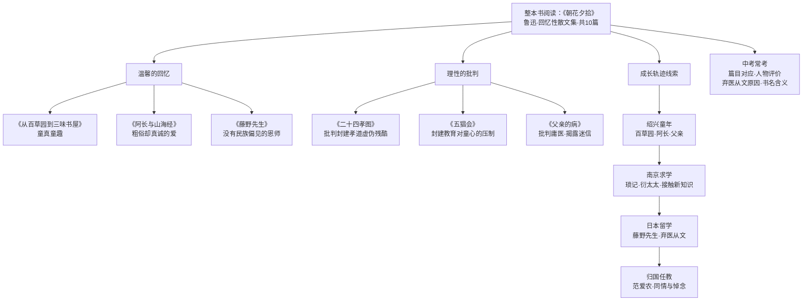

# 整本书阅读：《朝花夕拾》

标签：#名著导读 #中考必考

## 一、基本信息

| 项目 | 内容 |
|---|---|
| 作者 | 鲁迅 |
| 原名 | 《旧事重提》 |
| 性质 | 鲁迅唯一一部**回忆性散文集**，共 **10 篇** |
| 题目含义 | "早晨的花傍晚拾起"——中年回忆童年、少年、青年时期的人和事 |
| 阅读方法 | **消除与经典的隔膜**（教材主题词） |

## 二、十篇篇目速览

| 篇目 | 主要内容 | 关键词 |
|---|---|---|
| 《狗·猫·鼠》 | 仇猫的原因，隐鼠的故事 | 讽刺"正人君子" |
| 《阿长与〈山海经〉》 | 保姆长妈妈买来《山海经》 | 粗俗却真诚的爱 |
| 《二十四孝图》 | 批判封建孝道的虚伪残酷 | "老莱娱亲""郭巨埋儿" |
| 《五猖会》 | 看会前被父亲强迫背《鉴略》 | 封建教育对童心的压制 |
| 《无常》 | 民间迷信中"活无常"形象 | 公正的鬼、可爱的"鬼" |
| 《从百草园到三味书屋》 | 童年乐园与书塾生活 | 童真童趣 |
| 《父亲的病》 | 庸医误人，父亲病逝 | 批判庸医、揭露迷信 |
| 《琐记》 | 离家求学，南京读书 | 衍太太的虚伪；接触新知识 |
| 《藤野先生》 | 日本仙台学医，弃医从文 | 没有民族偏见的恩师 |
| 《范爱农》 | 潦倒的爱国知识分子之死 | 同情与悼念 |

> 💡 记忆口诀：猫鼠长孝五无常，百草父病琐藤范。

## 三、重要人物形象

| 人物 | 形象特点 |
|---|---|
| **长妈妈（阿长）** | 粗俗迷信、唠叨多礼，却朴实善良、真心爱"我"（买《山海经》） |
| **藤野先生** | 治学严谨、正直热忱、没有民族偏见（添改讲义、纠正解剖图） |
| **范爱农** | 正直倔强、愤世嫉俗的爱国知识分子，最终溺水而亡 |
| **父亲** | 严厉（五猖会前逼背书），"我"至今怀有愧疚 |
| **衍太太** | 表面慈善、实则自私阴险（怂恿孩子干坏事又散布流言） |

## 四、主题与线索

- **温馨的回忆**：百草园的乐趣、阿长的关爱、藤野先生的教诲；
- **理性的批判**：封建教育（五猖会、二十四孝图）、庸医误人、"正人君子"的虚伪；
- 全书隐含一条**鲁迅的成长轨迹**：绍兴童年 → 南京求学 → 日本留学（弃医从文）→ 归国任教。

## 五、中考常见考点

1. **篇目对应**：给情节选出处（如"添改讲义"→《藤野先生》）；
2. **人物评价**：结合两个情节分析阿长/藤野先生形象；
3. **弃医从文的原因**：匿名信事件 + 看电影（幻灯片）事件——救国先救精神；
4. **书名含义**与"温馨回忆 + 理性批判"双重色彩。

## 结构图解

## 六、阅读方法建议

1. 先读课内篇目[[9 从百草园到三味书屋（鲁迅）]]找到感觉；
2. 按"绍兴—南京—日本"的人生地图梳理十篇；
3. 每篇做一张"人物·情节·情感"卡片，消除隔膜。
