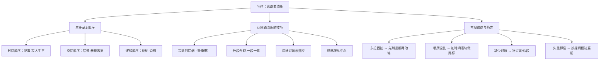

# 写作：思路要清晰

标签：#写作 #方法指导

## 一、什么叫"思路清晰"

思路，就是文章展开的**先后顺序与内在条理**。思路清晰的文章，读者能一眼看出"先写什么、再写什么、为什么这样安排"。

## 二、安排思路的三种基本顺序

| 顺序 | 适用 | 课文示例 |
|---|---|---|
| **时间顺序** | 记事、写人生平 | 《回忆我的母亲》按母亲一生经历展开 |
| **空间顺序** | 写景、参观游览 | 《从百草园到三味书屋》两个空间转换 |
| **逻辑顺序** | 议论、说明 | 《纪念白求恩》按"国际主义→毫不利己→精益求精"层层展开 |

## 三、让思路清晰的实用技巧

### 1. 写前列提纲（最重要）

动笔前用三五行搭好骨架：

```
题目：我的母亲
中心：母亲的勤劳与坚韧
① 开头：晨光中母亲的背影（引出）
② 主体：a.每天最早起床做饭（详）
        b.加班后仍辅导我作业（详）
        c.从不抱怨（略）
③ 结尾：回到背影，点题
```

### 2. 分段合理，一段一意

- 每段只说一层意思，段首可用**中心句**领起；
- 忌"一段到底"或随意分段。

### 3. 用好过渡与照应

- **过渡词句**："不必说……也不必说……单是……""可是，母亲又何尝不……"；
- **过渡段**：《从百草园到三味书屋》第 9 段承上启下；
- **首尾照应**：开头设景，结尾回应。

### 4. 详略服从中心

与中心关系密切的详写，其余略写——思路清晰不等于面面俱到。

## 四、常见病症诊断

| 病症 | 表现 | 药方 |
|---|---|---|
| 东拉西扯 | 想到哪写到哪 | 先列提纲再动笔 |
| 顺序混乱 | 时间前后跳跃无标志 | 加时间语句做"路标" |
| 缺少过渡 | 段与段之间生硬跳转 | 补过渡句/段 |
| 头重脚轻 | 开头冗长，重点仓促 | 按提纲控制各部分篇幅 |

## 五、写作实践指引

教材题目如《______的一天》《这天，我回家晚了》等：

1. 先确定中心与顺序（时间顺序最稳妥）；
2. 列提纲，标注详略；
3. 在关键转折处安排过渡句；
4. 完成后自查："各段顺序能否调换？"——若能随意调换，说明条理有问题。

## 结构图解



## 六、知识联系

- 提纲式构思配合[[如何突出中心]]的详略安排；
- 过渡段范例见[[9 从百草园到三味书屋（鲁迅）]]；
- 时间顺序范例见[[14 回忆我的母亲（朱德）]]。
