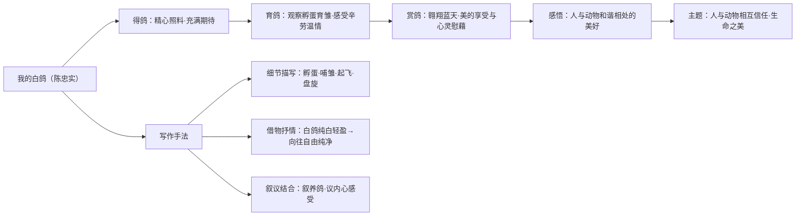

# 18 我的白鸽（陈忠实）

标签：#散文 #人与动物 #新选篇目

## 一、教材定位

第五单元（活动·探究单元）"文学阅读"篇目，统编版新修订教材新选课文。写作者养鸽、爱鸽的经历，表现人与动物之间温暖的情感交流。

## 二、文学常识

| 项目 | 内容 |
|---|---|
| 作者 | 陈忠实（1942—2016），陕西西安人，当代作家 |
| 代表作 | 长篇小说《白鹿原》（获茅盾文学奖） |
| 体裁 | 叙事散文 |

## 三、字词积累

| 字词 | 读音 | 释义/注意 |
|---|---|---|
| 雏 | chú | 幼小的（鸟），雏鸽 |
| 孵 | fū | 孵化（易误读 fú） |
| 啄 | zhuó | 鸟用嘴取食 |
| 翱翔 | áo xiáng | 在空中回旋地飞 |
| 盘旋 | pán xuán | 环绕着飞或走 |
| 羽翼 | yǔ yì | 翅膀 |
| 温顺 | wēn shùn | 温和顺从 |
| 抚弄 | fǔ nòng | 抚摸摆弄 |

## 四、内容梳理

文章以"我"与白鸽的交往为线索：

1. **得鸽**："我"得到一对白鸽，精心照料，充满期待；
2. **育鸽**：白鸽孵蛋、育雏，"我"观察它们哺育幼雏的辛劳与温情；
3. **赏鸽**：雏鸽长成，白鸽在天空翱翔，纯白的身影给"我"带来美的享受与心灵的慰藉；
4. **感悟**：鸽子的信任与亲近，让"我"体会到人与动物和谐相处的美好。

## 五、语言与写作手法

1. **细节描写**：对白鸽孵蛋、哺雏、起飞、盘旋的动作观察入微，画面感强；
2. **借物抒情**：白鸽的纯白、轻盈、自由，寄托了作者对**美好、纯净、自由生活**的向往；
3. **叙议结合**：叙述养鸽经过之中穿插内心感受，情感自然流露；
4. **以动物观照人生**：劳作之余仰望白鸽飞翔，是作者精神上的放松与滋养。

## 六、主题思想

通过记叙养育白鸽的经历，表现了**人与动物之间相互信任、彼此温暖的情谊**，表达了对生命之美的赞叹和对纯净、自由境界的向往。

## 七、考点与答题要点

- 梳理"我"与白鸽交往的过程及情感变化（期待 → 怜爱 → 惊喜 → 陶醉）；
- 赏析描写白鸽飞翔的语句：抓**动词**与**色彩**（白鸽与蓝天的映衬），答出画面美与作者情感；
- 理解白鸽对"我"的意义：不仅是宠物，更是**精神的慰藉与美的启迪**。

## 八、易错点提醒

- "孵"读 fū 不读 fú；"雏"读 chú；
- 本文重在**情感体验与生命之美**，不要答成说明鸽子习性的说明文；
- 作者陈忠实的代表作是《白鹿原》，勿与其他陕西作家混淆。

## 结构图解

## 九、知识联系

- 与[[17 猫（郑振铎）]]对读：同写人与动物，一为忏悔沉痛，一为温暖明朗；
- 观察动物的细节描写方法可迁移到[[写作：热爱生活，学会观察]]。
