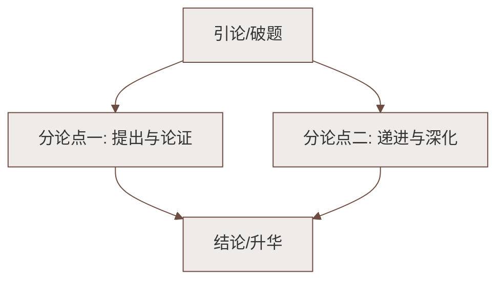

# 19 大雁归来（利奥波德）

标签：#科学观察笔记 #人与自然 #抒情性说明

## 一、教材定位

第五单元（活动·探究单元）"文学阅读"篇目。这是一篇富有文学色彩的**科学观察笔记**，观察对象是春天北归的大雁。

## 二、文学常识

| 项目 | 内容 |
|---|---|
| 作者 | 奥尔多·利奥波德（1887—1948），美国生态学家、环境保护主义先驱 |
| 出处 | 《沙乡年鉴》（一部影响深远的自然随笔与生态思想著作） |
| 体裁 | 科学观察笔记（兼具说明性与抒情性） |

## 三、字词积累

| 字词 | 读音 | 释义/注意 |
|---|---|---|
| 迁徙 | qiān xǐ | （鸟类等）随季节变化而转移栖息地（"徙"易误写为"徒"） |
| 缄默 | jiān mò | 闭口不说话 |
| 窥探 | kuī tàn | 暗中察看 |
| 沼泽 | zhǎo zé | 水草茂密的泥泞地带 |
| 瞄准 | miáo zhǔn | 对准目标 |
| 狩猎 | shòu liè | 打猎 |
| 盘旋 | pán xuán | 环绕着飞 |
| 喧嚷 | xuān rǎng | 大声喊叫，声音杂乱 |
| 目空一切 | | 形容骄傲自大，什么都不放在眼里 |

## 四、内容梳理

按时间顺序记录大雁的活动：

1. **三月大雁归来**：大雁是春天真正的使者——"一只燕子的来临说明不了春天，但当一群大雁冲破了三月暖流的雾霭时，春天就来到了"；
2. **雁群觅食**：飞往收割后的玉米地捡食玉米粒，来去有固定路线；
3. **孤雁的鸣叫**：孤雁的声调忧郁，作者推测它们是**失去亲人的幸存者**（暗指猎杀造成的伤害）；
4. **四月夜间群居的鸣叫**：集会、辩论般的喧闹，充满生命的活力；
5. **结尾感悟**：大雁的迁徙是**全球一体的生命现象**，联结起各大洲，是"带着野性的诗歌"。

## 五、语言与写作手法

1. **拟人**：把大雁称作"我们的客人""邻居"，写它们"辩论""发言""集会"——流露平等与喜爱；
2. **对比**：大雁与主教雀、花鼠对季节判断的对比，突出大雁归来的坚定（一旦北飞便不再折回）；
3. **观察+推理**：由孤雁的忧郁鸣叫推断其遭遇，体现科学观察笔记"**用事实说话又饱含情感**"的特点；
4. **抒情性议论**：结尾升华——大雁的迁徙是具有全球意义的生命律动。

## 六、主题思想

通过对大雁归来的观察与描写，表达了对大雁的**喜爱与尊重**，对**枪杀大雁行为的谴责与忧虑**，倡导**人与自然和谐共处、尊重并保护野生生命**的生态伦理观（即利奥波德著名的"土地伦理"思想）。

## 七、考点与答题要点

- 概括作者笔下大雁的特点：守信（三月准时归来）、坚定、群居喜鸣、重情（孤雁哀鸣）；
- 赏析拟人句：答出手法 + 大雁情态 + 作者的**平等友爱之情**；
- 理解"带着野性的诗歌"：大雁鸣声是自然生命力的象征，给荒凉的冬去春来带来生机与美；
- 体会文中数字与观察记录（如"六只，或六的倍数"）：体现**科学精神**——观察、统计、求证。

## 八、易错点提醒

- "迁徙"的"徙"（xǐ）勿写成"徒"；"缄默"读 jiān；
- 本文不是纯说明文：说明中带浓厚**抒情**，答"语言特点"时两者都要提；
- 作者是**美国**生态学家，出自《沙乡年鉴》，文学常识易考。

## 九、知识联系

- 与[[17 猫（郑振铎）]]、[[18 我的白鸽（陈忠实）]]共同构成本单元"人与动物"主题群文；
- 观察记录式写法可迁移到[[写作：热爱生活，学会观察]]。

### 语文阅读与写作结构

