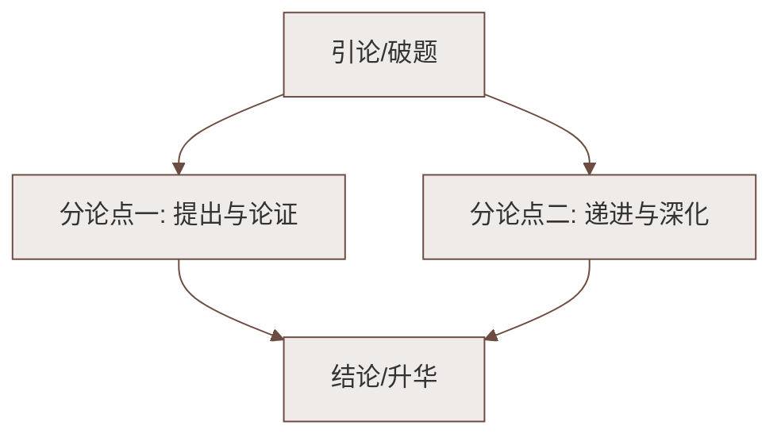

# 21 小圣施威降大圣（吴承恩）

标签：#古典小说 #神话想象 #《西游记》

## 一、教材定位

第六单元课文。本单元的课文体裁多样（童话、神话、寓言、古典小说节选），共同特点是**富于联想和想象**。本课节选自《西游记》第六回。

## 二、文学常识

| 项目 | 内容 |
|---|---|
| 作者 | 吴承恩（约 1500—约 1582），字汝忠，号射阳山人，明代小说家 |
| 出处 | 《西游记》第六回"观音赴会问原因，小圣施威降大圣" |
| 体裁 | 长篇章回体神魔（神话）小说节选 |
| 题解 | "小圣"指二郎神杨戬，"大圣"指孙悟空——二郎神施展神威降伏孙悟空 |

## 三、字词积累

| 字词 | 读音 | 释义/注意 |
|---|---|---|
| 掣 | chè | 拔、抽（掣棒） |
| 鹚老 | cí | 鱼鹰一类的水鸟 |
| 青鹞 | yào | 一种猛禽 |
| 鹭鸶 | lù sī | 白鹭 |
| 鳜鱼 | guì | 一种淡水鱼（易误读 jué） |
| 幌 | huǎng | 摇晃、闪过 |
| 木木樗樗 | chū | 形容痴痴呆呆的样子 |
| 蓼汀 | liǎo tīng | 长着蓼草的小洲 |
| 躘踵 | lóng zhǒng | 踉跄欲跌的样子 |
| 淬 | cuì | 文中指浸入水中 |
| 猢狲 | hú sūn | 猴子 |

## 四、情节梳理：一场"变化"大战

孙悟空与二郎神赌变化、弄神通，逃与追环环相扣：

| 悟空变 | 二郎神应对 |
|---|---|
| 麻雀 | 变饿鹰扑打 |
| 大鹚老（冲天而去） | 变大海鹤钻云嗛之 |
| 鱼儿（入水） | 变鱼鹰水面等候 |
| 水蛇（钻草） | 变灰鹤啄之 |
| 花鸨（立蓼汀） | 现原身，用弹弓打 |
| 土地庙（尾巴变旗杆立在后面） | 识破——"旗杆立在后面"露了破绽 |
| 变二郎神模样进庙 | 赶到识破，两人现身打斗 |

## 五、语言与写作手法

1. **想象奇特**：双方变化一物克一物，环环相扣，紧张中充满谐趣；
2. **细节传神**："尾巴不好收拾，竖在后面变做一根旗杆"——既符合猴子的生理特点，又制造笑点，体现悟空**机敏又顽皮**的形象；
3. **动词精准**：钻、飞、变、扑、嗛、啄，动作描写干净利落；
4. **详略得当**：变化斗法详写，打斗过程略写。

## 六、人物形象

- **孙悟空**：神通广大、随机应变、机智顽皮，虽处劣势仍从容不迫；
- **二郎神**：本领高强、沉着冷静、眼力过人，始终紧追不舍。
- 两人棋逢对手，斗智斗勇的过程正是本文的趣味所在。

## 七、考点与答题要点

- 梳理"变化—应变"的对应链条（表格题高频）；
- 赏析想象的妙处：变化**符合事物特点**（如鱼儿对鱼鹰）、又出人意料，趣味横生；
- 体会喜剧色彩：紧张的追杀写得妙趣横生，语言幽默诙谐。

## 八、易错点提醒

- "小圣"是二郎神，"大圣"才是孙悟空，题目含义勿弄反；
- 《西游记》作者一般署名吴承恩，**明代**人；体裁是章回体长篇神魔小说；
- "鳜"读 guì，"掣"读 chè。

## 九、知识联系

- 本课是[[发挥联想和想象／整本书阅读：《西游记》／课外古诗词诵读：秋词（其一）／夜雨寄北／十一月四日风雨大作（其二）／潼关]]中《西游记》整本书阅读的切入篇目；
- 奇特想象的写法与[[23* 女娲造人（袁珂）]]、[[22 皇帝的新装（安徒生）]]一脉相通。

### 语文阅读与写作结构

