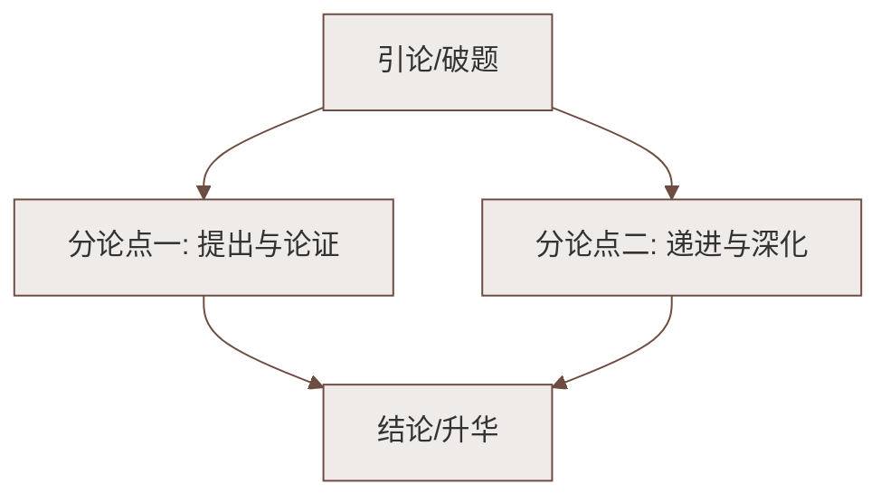

# 22 皇帝的新装（安徒生）

标签：#中考高频 #童话 #讽刺

## 一、教材定位

第六单元课文，本单元学习**联想与想象**。这是一篇经典童话，以夸张的想象讽刺现实。

## 二、文学常识

| 项目 | 内容 |
|---|---|
| 作者 | 安徒生（1805—1875），丹麦作家，世界著名童话大师 |
| 代表作 | 《卖火柴的小女孩》《海的女儿》《丑小鸭》《拇指姑娘》等 |
| 体裁 | 童话（以想象和夸张塑造形象、反映生活） |

## 三、字词积累

| 字词 | 读音 | 释义/注意 |
|---|---|---|
| 炫耀 | xuàn yào | 夸耀 |
| 称职 | chèn zhí | 能胜任职务（"称"易误读 chēng） |
| 妥当 | tuǒ dang | 稳妥适当 |
| 呈报 | chéng bào | 报告（上级） |
| 钦差 | qīn chāi | 皇帝派遣的大臣 |
| 滑稽 | huá jī | 言语动作引人发笑（"稽"易误读） |
| 陛下 | bì xià | 对君主的尊称 |
| 爵士 | jué shì | 一种贵族称号 |
| 骇人听闻 | hài | 使人听了非常吃惊 |
| 随声附和 | fù hè | 别人说什么自己跟着说什么（"和"读 hè） |

## 四、情节梳理

以"新装"为线索：

**爱新装（引子）→ 做新装（骗子设局）→ 看新装（君臣视察）→ 穿新装（游行大典）→ 揭新装（孩子说真话）**

- 骗子的圈套：宣称布料"任何不称职的或者愚蠢得不可救药的人，都看不见"——这句话是全文的**关键**，它让所有人不敢说真话；
- 老大臣、官员、皇帝先后视察，都看不见布料却齐声称赞；
- 游行大典上一个**小孩子**喊出："可是他什么衣服也没有穿哇！"

## 五、人物形象

| 人物 | 形象特点 |
|---|---|
| 皇帝 | 昏庸虚荣、愚蠢自欺、穷奢极欲（一切心思都在穿衣上） |
| 大臣官员 | 虚伪自私、阿谀奉承，为保官位说假话 |
| 骗子 | 狡猾贪婪，深谙人性弱点 |
| 小孩子 | 天真无邪、无私无畏，敢说真话 |

## 六、写作手法与主题

1. **夸张**：皇帝每一天每一点钟都要换一套衣服；光着身子游行——极度夸张造成强烈讽刺效果；
2. **想象**：整个骗局建立在"看不见的布"这一奇特想象上，情节荒诞却合乎人性逻辑；
3. **心理描写**：皇帝"我什么也没有看见！难道我是愚蠢的吗？"——自欺欺人的心理刻画入木三分；
4. **对比**：大人的集体说谎 vs 孩子的一句真话。

**主题**：讽刺了统治者的**昏庸虚伪、愚蠢自欺**和社会上**自欺欺人、随声附和**的风气；赞美了**天真无邪、敢说真话**的童心；启示人们要保持纯真，敢于说真话。

## 七、考点与答题要点

- 为什么大家都不敢说真话？——怕被认为"不称职"或"愚蠢"，**私心（保住地位、名声）**使人自欺欺人；
- 为什么让**小孩子**说出真相？——孩子天真无私、无所顾忌，最有说服力，也寄托了作者的理想；
- 结尾皇帝"有点儿发抖"却"摆出一副更骄傲的神气"把戏演下去：讽刺其**死要面子、虚伪到底**；
- 概括线索："新装"贯穿全文（线索题高频）。

## 八、易错点提醒

- "称职"读 chèn，"随声附和"读 hè，"骇人听闻"勿写成"害人听闻"；
- 安徒生是**丹麦**作家，勿写成德国/英国；
- 主题除讽刺外，别漏掉"**赞美童真、呼唤真话**"这一层。

## 九、知识联系

- 与[[赫耳墨斯和雕像者]]、[[蚊子和狮子]]同样借虚构故事讽喻人性弱点；
- 夸张与想象手法可用于[[发挥联想和想象／整本书阅读：《西游记》／课外古诗词诵读：秋词（其一）／夜雨寄北／十一月四日风雨大作（其二）／潼关]]的写作实践。

### 语文阅读与写作结构

