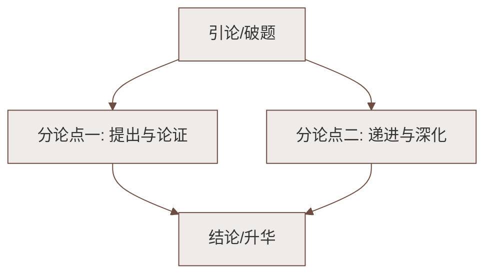

# 赫耳墨斯和雕像者

标签：#寓言 #《伊索寓言》 #《寓言四则》

## 一、教材定位

第六单元《寓言四则》第一则，选自古希腊《伊索寓言》。寓言：用**假托的故事**寄寓意味深长的道理，篇幅短小，主人公可以是人、动物或神。

## 二、文学常识

| 项目 | 内容 |
|---|---|
| 出处 | 《伊索寓言》——古希腊寓言汇编，相传为奴隶伊索所作 |
| 同书名篇 | 《农夫和蛇》《狐狸和葡萄》《龟兔赛跑》等 |
| 主人公 | 赫耳墨斯：希腊神话中掌管旅行与商业的神，宙斯的儿子、传旨者 |

## 三、字词积累

| 字词 | 读音 | 释义/注意 |
|---|---|---|
| 赫耳墨斯 | hè | 希腊神名 |
| 雕像 | diāo xiàng | 雕刻的人像 |
| 庇护 | bì hù | 袒护、保护（易误读 pì） |
| 爱慕虚荣 | | 喜欢表面上的光彩 |
| 添头 | tiān tou | 白送的东西 |

## 四、情节梳理

1. 赫耳墨斯想知道自己**在人间受到多大的尊重**，化作凡人来到雕像者的店里；
2. 问**宙斯**（众神之王）雕像的价钱——"一个银元"；
3. 笑着问**赫拉**（天后）雕像——"还要贵一点儿"；
4. 心想自己是神的使者、商人的庇护神，人们对他会更尊重，问**自己**的雕像——
5. 结果："假如你买了那两个，这个算**添头**，白送。"

三问三答，层层蓄势，结尾陡转，讽刺效果强烈。

## 五、寓意与写作特点

**寓意**（课文点明）：讽刺了那些**爱慕虚荣、妄自尊大而不被别人重视**的人。

写作特点：

1. **心理描写推动情节**："想知道""笑着问""心想人们会对他更尊重"——虚荣心一步步膨胀；
2. **对话展开故事**：全篇以三次问价的对话构成，简洁紧凑；
3. **结尾反转**：期望值最高处摔得最重，"添头"与自我期许形成巨大落差，讽刺入骨。

## 六、考点与答题要点

- "笑着问道"的"笑"有什么表现力？——写出赫耳墨斯**自以为身价必高于赫拉**的得意与轻慢，为结尾反转蓄势；
- 赫耳墨斯三次问价的顺序能否调换？——不能。先问最高的宙斯、再问赫拉、最后问自己，**层层递进**，把自我期待推到顶点，反转才有力；
- 概括寓意时要落到"**爱慕虚荣、自命不凡者往往不被人重视**"。

## 七、易错点提醒

- "庇护"读 bì；
- 赫耳墨斯问价的动机是**虚荣心**（想知道自己受多大尊重），不是真想买雕像；
- 寓言的寓意要**从故事本身概括**，不可无限引申。

## 八、知识联系

- 与[[蚊子和狮子]]同出《伊索寓言》，同属《寓言四则》；
- 与[[穿井得一人]]、[[杞人忧天]]（中国古代寓言）对比：中外寓言都借小故事说大道理。

### 语文阅读与写作结构

