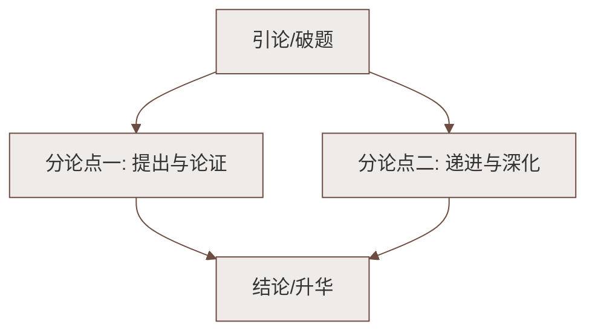

# 1 邓稼先

标签：#中考高频 #人物传记 #家国情怀

## 一、文学常识

| 项目 | 内容 |
|---|---|
| 作者 | 杨振宁（1922— ），物理学家，诺贝尔物理学奖获得者 |
| 传主 | 邓稼先（1924—1986），"两弹元勋"，核物理学家 |
| 体裁 | 人物传记（回忆性散文） |
| 关系 | 作者与邓稼先是同乡、同学，有半个世纪的深厚友情 |

## 二、课文结构：六个小标题

1. **从"任人宰割"到"站起来了"**——百年屈辱史的背景，引出邓稼先的历史地位；
2. **"两弹"元勋**——简介生平：1958 年受命研制原子弹，1964 年原子弹、1967 年氢弹爆炸成功；
3. **邓稼先与奥本海默**——对比手法：奥本海默锋芒毕露，邓稼先忠厚平实、"最不引人注目"；
4. **民族感情？友情？**——1971 年来信证实中国原子弹基本无外国人参与，作者热泪盈眶；
5. **"我不能走"**——戈壁滩上井下出现意外时，邓稼先坚守一线，凸显奉献精神；
6. **永恒的骄傲**——引用书信电报，总结评价："永恒的骄傲"。

## 三、重点字词

| 字词 | 读音 | 释义 |
|---|---|---|
| 元勋 | yuán xūn | 立大功的人 |
| 鲜为人知 | xiǎn wéi rén zhī | 很少有人知道（"鲜"易误读） |
| 锋芒毕露 | fēng máng bì lù | 才干完全显露 |
| 鞠躬尽瘁，死而后已 | jū gōng jìn cuì | 竭尽劳苦贡献一切，到死为止 |
| 妇孺皆知 | fù rú jiē zhī | 妇女儿童都知道，人人皆知 |
| 至死不懈 | xiè | 到死都不松懈 |
| 殷红 | yān hóng | 带黑的红色（多音字：yīn 殷勤） |

## 四、写作特色与段落分析

1. **小标题结构**：六个部分各有侧重又浑然一体，条理清晰，便于多角度展现人物；
2. **对比衬托**：以奥本海默的"锋芒毕露"反衬邓稼先"忠厚朴实、真诚坦白"，突出中国传统文化孕育的品格；
3. **大背景写小人物**：把邓稼先放在近百年民族历史的大背景中，突出他"把中华民族国防自卫武器引导到了世界先进水平"的贡献；
4. **句式变化**：长短句结合，第五部分引用《吊古战场文》与"五四"时代歌曲，渲染悲壮氛围。

## 五、主题思想

课文以中华几千年文化为背景、以近一百多年民族情结与五十年朋友深情为基调，
歌颂了邓稼先**忠诚纯正、无私奉献、鞠躬尽瘁**的精神，他是"**中国几千年传统文化所孕育出来的有最高奉献精神的儿子**"。

## 六、练习题

1. 文中为什么要写奥本海默？
   > 运用对比，突出邓稼先忠厚平实、毫无私心的性格，说明他的品格植根于中国传统文化。
2. "我不能走"一句表现了邓稼先怎样的精神？
   > 身先士卒、临危不惧、以身许国的献身精神。
3. 解释"鞠躬尽瘁，死而后已"并造句。
   > 出自诸葛亮《后出师表》，形容小心谨慎、贡献全部力量到死为止。

## 七、知识联系

- 同单元[[2 说和做——记闻一多先生言行片段]]同写杰出人物，都表现家国担当，可比较写法；
- 与[[3* 列夫·托尔斯泰]]比较：一写精神品格，一重外貌刻画；
- 学完本单元用[[写作：写出人物特点]]练习抓典型事例写人。

### 语文阅读与写作结构

