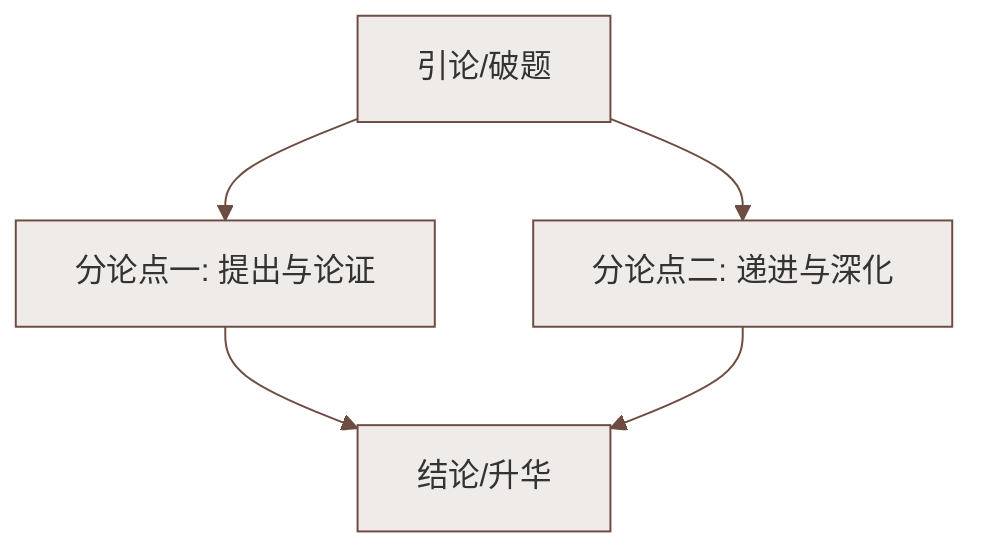

# 2 说和做——记闻一多先生言行片段

标签：#中考高频 #人物散文 #夹叙夹议

## 一、文学常识

| 项目 | 内容 |
|---|---|
| 作者 | 臧克家（1905—2004），诗人，代表作《烙印》《有的人》 |
| 传主 | 闻一多（1899—1946），诗人、学者、民主战士，代表作《红烛》《死水》 |
| 关系 | 臧克家是闻一多的学生，两人情谊深厚 |
| 体裁 | 写人记事散文（夹叙夹议） |

## 二、课文结构：两部分两重身份

1. **作为学者的闻一多**（第 1—7 段）——"做了再说，做了不说"：
   - 写作《唐诗杂论》："目不窥园，足不下楼"，"头发凌乱""睡得很少"；
   - 写作《楚辞校补》《古典新义》：潜心贯注、心会神凝；
2. **作为革命家的闻一多**（第 8—18 段）——"说了就做"：
   - 起稿政治传单、群众大会演说（《最后一次讲演》）、参加游行示威；
   - "他，是口的巨人。他，是行的高标。"——总评收束。

## 三、重点字词

| 字词 | 读音 | 释义 |
|---|---|---|
| 诗兴不作 | zuò | 写诗的兴致减少了（"作"：兴起） |
| 典籍 | diǎn jí | 记载古代法制、图书等的重要文献 |
| 仰之弥高 | mí | 越抬头看越觉得高（出自《论语》） |
| 锲而不舍 | qiè | 不停地雕刻，比喻有恒心 |
| 兀兀穷年 | wù wù | 辛辛苦苦地一年到头这样做 |
| 沥尽心血 | lì | 滴尽了心血，费尽心思 |
| 迥乎不同 | jiǒng | 很不一样 |
| 慷慨淋漓 | kāng kǎi lín lí | 充满正气、情绪激昂 |
| 气冲斗牛 | dǒu niú | 形容气势之盛可以直冲云霄（"斗"易误读） |

## 四、段落与写法分析

1. **过渡衔接**：第 7 段"做了再说，做了不说，这仅是闻一多先生的一个方面"承上启下，使两部分自然过渡；
2. **选材精当**：学者方面选三部著作，革命家方面选三件大事，以少胜多；
3. **细节描写**："一个又一个大的四方竹纸本子，写满了密密麻麻的小楷"——表现治学严谨；
4. **语言诗化**：多用四字短语、对偶句（"不动不响，无声无闻"），凝练生动，富有节奏感与感染力；
5. **夹叙夹议**：叙述中穿插精辟议论，起总领、过渡、总结作用。

## 五、主题思想

文章记述闻一多先生作为学者"做了再说、做了不说"和作为革命家"说了就做"的言行片段，
表现他**严谨治学、无私无畏、言行一致**的品格，赞扬他为民主事业**献身**的精神。

## 六、练习题

1. 闻一多前期与后期在"说和做"上有何不同？为什么有这种变化？
   > 前期潜心学术，做了不说；后期投身民主运动，说了就做。变化源于时代与救国道路认识的转变，不变的是爱国精神。
2. 赏析"他要给我们衰微的民族开一剂救济的文化药方"。
   > 比喻，把研究文化典籍比作"开药方"，写出他做学问的目的是救国。
3. 结尾两句独立成段有何作用？
   > 总结全文，高度评价，句式短促有力，感情强烈。

## 七、知识联系

- 与[[1 邓稼先]]同写爱国知识分子，前者用小标题、大背景，本文用两重身份对照；
- 外貌与性格刻画可对比[[3* 列夫·托尔斯泰]]的欲扬先抑；
- 选取典型言行写人的方法用于[[写作：写出人物特点]]。

### 语文阅读与写作结构

