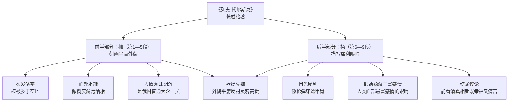

# 3* 列夫·托尔斯泰

标签：#中考高频 #人物传记 #外貌描写 #欲扬先抑

## 一、文学常识

| 项目 | 内容 |
|---|---|
| 作者 | 茨威格（1881—1942），奥地利作家，代表作《三作家》《人类群星闪耀时》 |
| 出处 | 节选自传记《三作家》 |
| 传主 | 列夫·托尔斯泰（1828—1910），俄国伟大作家 |
| 传主代表作 | 《战争与和平》《安娜·卡列尼娜》《复活》 |

## 二、课文结构：先抑后扬

1. **前半部分（第 1—5 段）：刻画外貌——"抑"**
   - 须发浓密："植被多于空地"；
   - 面部粗糙："像树皮一样藏污纳垢"；
   - 表情蒙昧阴沉、缺乏光彩；
   - 长相平平，"是俄国普通大众的一员"；
2. **后半部分（第 6—9 段）：描写眼睛——"扬"**
   - 目光犀利："像枪弹穿透了伪装的甲胄"；
   - 眼睛蕴藏丰富感情，"是人类面部最富感情的一对眼睛"；
   - 眼睛具有威力：观察社会、洞察人生；
   - 结尾议论：能看清真相的人，既幸福又痛苦。

## 三、重点字词

| 字词 | 读音 | 释义 |
|---|---|---|
| 胡髭 | zī | 嘴上边的胡子 |
| 长髯 | rán | 两腮的长胡子 |
| 黝黑 | yǒu | 黑，黑暗 |
| 粗劣 | liè | 粗糙低劣 |
| 滞留 | zhì | 停留不动 |
| 愚钝 | yú dùn | 愚笨，不伶俐 |
| 犀利 | xī lì | （目光、言辞）锋利，锐利 |
| 藏污纳垢 | gòu | 比喻包容坏人坏事 |
| 郁郁寡欢 | yù | 心情苦闷，不快乐 |
| 鹤立鸡群 | hè | 比喻才能或仪表出众 |
| 正襟危坐 | jīn | 理好衣襟端端正正坐着，形容严肃庄重 |
| 广袤无垠 | mào yín | 广阔无边 |

## 四、写法分析

1. **欲扬先抑**：极力渲染外貌的平庸丑陋，反衬眼睛的精美绝伦与灵魂的高贵，形成巨大反差；
2. **比喻夸张连用**："像枪弹穿透了伪装的甲胄，它像金刚刀切开了玻璃"——写目光的敏锐犀利，生动传神；
3. **欲抑实扬的深意**：外貌平庸恰恰说明他属于人民大众，与他人道主义的灵魂一致。

## 五、主题思想

课文通过描写托尔斯泰**平庸粗陋的外貌**与**深邃犀利的眼睛**，
展示他**深邃而卓越的精神世界**，表达作者对这位"具有看透事物本质的眼光"的伟大作家的**崇敬与赞美**。

## 六、练习题

1. 前半部分极力"丑化"外貌，是否有损人物形象？
   > 不是。这是欲扬先抑，外貌的平庸反衬眼睛和灵魂的不凡，也表明他是人民大众的一员。
2. 赏析"这道目光就像一把锃亮的钢刀刺了过来，又稳又准，击中要害"。
   > 比喻，把目光比作钢刀，写出目光的犀利、敏锐，具有洞察力。
3. 如何理解"能够看清真相的人"是"幸福"还是"不幸"？
   > 他能看透社会黑暗与人间苦难，是智慧的幸福；但看清而无力改变，又深感痛苦，是清醒者的不幸。

## 结构图解

## 七、知识联系

- 与[[1 邓稼先]][[2 说和做——记闻一多先生言行片段]]同属写人单元：本课重外貌传神，前两课重事迹言行；
- 欲扬先抑、抓特征写外貌的技巧直接用于[[写作：写出人物特点]]。
