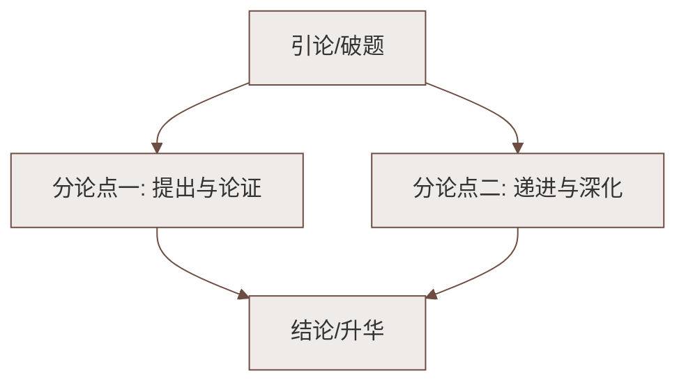

# 4 孙权劝学

标签：#中考必考 #文言文 #背诵篇目

## 一、文学常识

| 项目 | 内容 |
|---|---|
| 出处 | 《资治通鉴》 |
| 编者 | 司马光（1019—1086），北宋政治家、史学家 |
| 体例 | 编年体通史，记载从战国到五代共 1362 年史事 |
| 书名由来 | 宋神宗认为此书"鉴于往事，有资于治道" |

## 二、课文要点与情节

- **孙权劝学**：指出吕蒙"当涂掌事，不可不学"；现身说法"孤常读书，自以为大有所益"；
- **吕蒙就学**："蒙乃始就学"——从"辞以军中多务"到接受劝告；
- **鲁肃赞学**："卿今者才略，非复吴下阿蒙！"——侧面表现吕蒙学有所成；
- **结友而别**：鲁肃"拜蒙母，结友而别"——进一步烘托吕蒙的进步。

## 三、重点字词（文言积累）

| 词句 | 释义 |
|---|---|
| 卿今**当涂**掌事 | 当道，当权 |
| 蒙**辞**以军中多务 | 推托 |
| 孤岂欲卿**治经**为博士邪 | 研究儒家经典 |
| 但当**涉猎** | 粗略地阅读 |
| **见往事**耳 | 了解历史（往事：指历史） |
| 及鲁肃**过**寻阳 | 经过 |
| 卿今者**才略** | 才干和谋略 |
| **非复**吴下阿蒙 | 不再是 |
| 即**更**刮目相待 | 另，另外（gēng） |
| **见事**之晚乎 | 知晓事情 |

**通假字**：孤岂欲卿治经为博士**邪**（"邪"通"耶"，语气词"吗"）。
**古今异义**：博士（古：专掌经学传授的学官；今：学位）；往事（古：历史；今：过去的事）。

## 四、重点句翻译

1. 卿今当涂掌事，不可不学！
   > 你现在当权管事了，不可以不学习！
2. 孤岂欲卿治经为博士邪！但当涉猎，见往事耳。
   > 我难道想要你研究儒家经典成为博士吗！只应当粗略地阅读，了解历史罢了。
3. 士别三日，即更刮目相待，大兄何见事之晚乎！
   > 士人分别多日，就要重新拭目相看，长兄为什么知晓事情这么晚呢！

## 五、写法与主题

1. **对话描写为主**：全文主要通过孙权、吕蒙、鲁肃三人对话推进，语言简练传神；
2. **侧面描写**：借鲁肃的惊叹侧面表现吕蒙学习成效，不直接写如何学；
3. **详略得当**：详写"劝学""赞学"，略写"就学"；
4. **主题**：通过孙权劝学、吕蒙就学、鲁肃赞学的故事，说明**开卷有益、学无止境**，只要肯学，就会有长进，成年人也不例外。

## 六、成语积累

- **吴下阿蒙**：比喻学识尚浅的人；
- **刮目相待（看）**：用新的眼光看待人。

## 七、练习题

1. 孙权是怎样劝吕蒙学习的？
   > 先指出学习的必要性（当涂掌事），再针对推托降低要求（但当涉猎），最后现身说法（孤常读书大有所益），言辞恳切。
2. 鲁肃为什么与吕蒙"结友"？
   > 鲁肃敬才爱才，被吕蒙的才略折服，也从侧面表现吕蒙进步之大。
3. 本文给你的启示？
   > 学习没有早晚，贵在坚持；要善于听取正确的意见；要用发展的眼光看人。

## 八、知识联系

- 同为劝勉勤学的文言文，可与[[13 卖油翁]]（熟能生巧）比较主旨；
- 文言词法积累与[[17 短文两篇（陋室铭；爱莲说）]][[25 活板]]互相巩固。

### 语文阅读与写作结构

