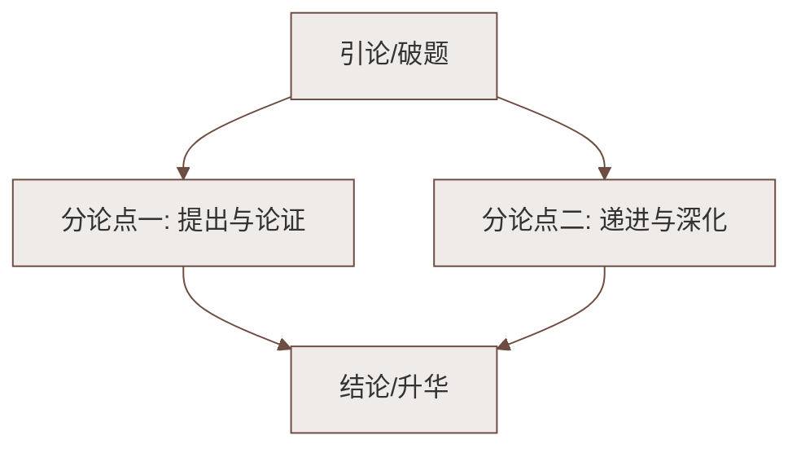

# 写作：写出人物特点

标签：#写作训练 #写人记事

## 一、训练目标

1. 学会观察人物，抓住人物**区别于他人的独特之处**；
2. 会用**典型事例**和**细节描写**表现人物特点；
3. 能综合运用外貌、语言、动作、心理等描写方法。

## 二、什么是"人物特点"

- **外在特点**：容貌、体态、衣着、语言习惯（如托尔斯泰的浓密须发）；
- **内在特点**：性格、气质、品格、爱好（如邓稼先的忠厚朴实）；
- 关键：写出"**这一个**"，避免千人一面。

## 三、写出人物特点的方法

### 1. 抓外貌特征，忌面面俱到
- 只写最能体现个性的一两处，如鲁迅"隶体'一'字似的胡须"；
- 可借鉴[[3* 列夫·托尔斯泰]]：夸张、比喻突出特征，甚至欲扬先抑。

### 2. 选典型事例
- 事例要**能证明特点**：写"勤奋"就选"目不窥园"式的事；
- 借鉴[[2 说和做——记闻一多先生言行片段]]：学者选三部书、革命家选三件事，以少胜多；
- 一件事写透胜过十件事罗列。

### 3. 用细节说话
- 动作细节："父亲又像问自己又像问我"；
- 语言细节：符合人物身份、年龄、性格的"个性化语言"；
- 借鉴[[1 邓稼先]]"我不能走"——一句话立起一个人。

### 4. 借助对比衬托
- 人物间对比（邓稼先与奥本海默）；
- 前后变化对比（[[4 孙权劝学]]中"吴下阿蒙"与"刮目相待"）。

## 四、常见问题与对策

| 问题 | 对策 |
|---|---|
| 特点标签化，只喊"他很勤奋" | 用具体事例、细节呈现，让读者自己得出结论 |
| 外貌描写公式化（大眼睛、高鼻梁） | 只抓最独特的一两处特征 |
| 事例与特点脱节 | 下笔前先问：这件事能证明这个特点吗 |
| 平均用力，无详略 | 主事例详写，次事例一笔带过 |

## 五、写作实践（教材题目）

1. **片段练习**：写身边同学的外貌，不出现姓名，让大家猜是谁——检验是否抓住特征；
2. **《我的好朋友》**：选取一两件典型事例，突出朋友与众不同之处；
3. **《争论》**：抓住争论中各人的语言、神态、动作，写出不同人物的特点。

## 六、范文提纲示例：《我的好朋友》

1. 开头：特征式亮相（外貌或口头禅切入）；
2. 主体：典型事例一（详）——表现核心特点；典型事例二（略）——补充丰富形象；
3. 结尾：点题，写出"我"对朋友的情感。

## 七、知识联系

- 本单元三篇课文[[1 邓稼先]][[2 说和做——记闻一多先生言行片段]][[3* 列夫·托尔斯泰]]都是写人范本；
- 细节描写训练将在[[写作：抓住细节]]中深化；
- 选材问题将在[[写作：怎样选材]]中系统学习。

### 语文阅读与写作结构

