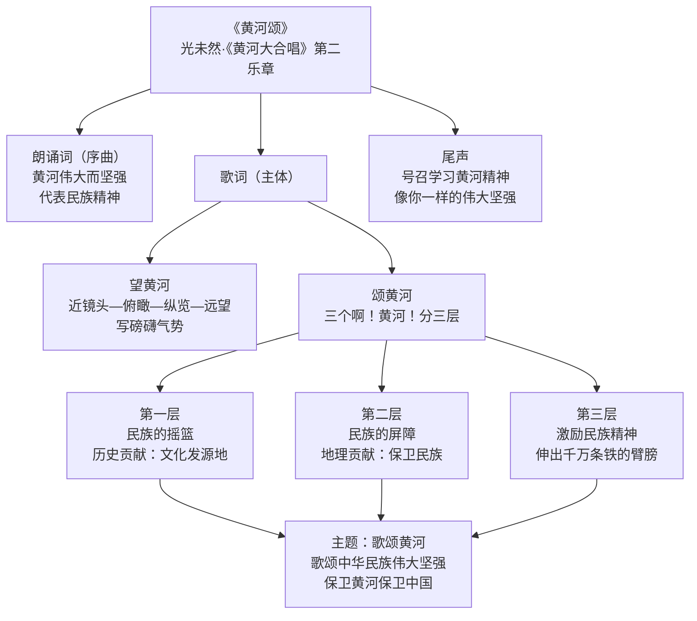

# 5 黄河颂

标签：#中考高频 #现代诗歌 #爱国主义 #朗诵

## 一、文学常识

| 项目 | 内容 |
|---|---|
| 作者 | 光未然（1913—2002），原名张光年，现代诗人 |
| 出处 | 组诗《黄河大合唱》第二乐章 |
| 作曲 | 冼星海谱曲，1939 年首演于延安 |
| 背景 | 抗日战争时期，激励中华儿女保卫黄河、保卫中国 |
| 体裁 | 现代抒情诗（颂歌） |

## 二、课文结构

1. **朗诵词**（序曲）：直接点题——黄河"伟大而又坚强"，代表民族精神；
2. **歌词**（主体）：
   - **望黄河**（"我站在高山之巅……劈成南北两面"）：近镜头—俯瞰—纵览—远望，写黄河磅礴气势；
   - **颂黄河**：三个"啊！黄河！"分三层——
     ① 黄河是**民族的摇篮**（历史贡献：文化发源地）；
     ② 黄河是**民族的屏障**（地理贡献：保卫民族）；
     ③ 黄河**激励民族精神**（精神贡献："伸出千万条铁的臂膀"）；
   - **尾声**：号召学习黄河精神，"像你一样的伟大坚强"。

## 三、重点字词

| 字词 | 读音 | 释义 |
|---|---|---|
| 巅 | diān | 山顶 |
| 澎湃 | péng pài | 波浪互相撞击，形容声势浩大 |
| 狂澜 | kuáng lán | 巨大的波浪，比喻动荡的局势 |
| 屏障 | píng zhàng | 像屏风那样遮挡着的东西 |
| 哺育 | bǔ yù | 喂养，培养 |
| 九曲连环 | qū | 曲折，回环（"曲"易误读） |
| 浊流宛转 | zhuó | 浑浊的水流 |

## 四、重点语句赏析

**"惊涛澎湃，掀起万丈狂澜；浊流宛转，结成九曲连环。"**
- 对偶、夸张，从纵横两方面写黄河奔腾磅礴的气势。

**"啊！黄河！你是中华民族的摇篮！"**
- 比喻，把黄河比作摇篮，形象写出黄河是中华文明的发祥地；
- "啊！黄河！"反复三次，形成回环往复的旋律，是"颂"的主线索。

**"你一泻万丈，浩浩荡荡，向南北两岸伸出千万条铁的臂膀。"**
- 拟人，"臂膀"指黄河的支流，写出黄河气势磅礴、泽被众生、勇不可挡。

## 五、主题思想

诗人借歌颂黄河**气势宏伟、源远流长**，歌颂中华民族**伟大坚强的精神**，
号召中华儿女学习黄河精神，**保卫黄河、保卫中国**，表达强烈的爱国情怀。

## 六、练习题

1. 诗中反复出现"啊！黄河！"有什么作用？
   > 反复咏叹，把歌词主体分为三层，由实到虚、层层深入，强化颂扬之情。
2. 如何理解黄河"向南北两岸伸出千万条铁的臂膀"？
   > 支流像臂膀护卫大地，象征黄河哺育、护卫着中华民族，体现磅礴伟力。
3. 朗诵设计："望黄河"部分语调应激越高亢，"颂"的三层递进上扬，结尾坚定有力。

## 结构图解

## 七、知识联系

- 同单元[[8* 土地的誓言]]同为抗战背景下的家国抒怀，一颂河、一恋土；
- 直接抒情（呼告、反复）的手法可用于[[写作：学习抒情]]；
- 与[[6 老山界]]同表现民族危亡中的精神力量。
