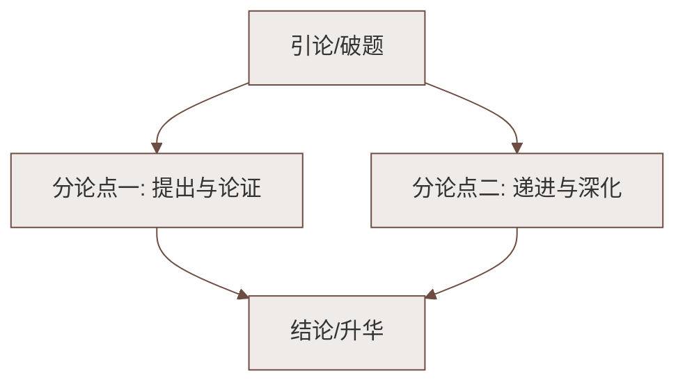

# 6 老山界

标签：#中考高频 #回忆性散文 #红军长征

## 一、文学常识

| 项目 | 内容 |
|---|---|
| 作者 | 陆定一（1906—1996），江苏无锡人，曾任红军总政治部宣传部部长 |
| 背景 | 1934 年红军长征，翻越"长征中所过的第一座难走的山"——老山界（越城岭） |
| 体裁 | 回忆性叙事散文 |
| 线索 | 时间变化和地点转移（顺叙） |

## 二、课文结构（按时间地点推移）

1. **当天下午—天黑**：山脚访瑶民——军民关系融洽，宣传红军主张；
2. **天黑—夜里**：夜爬雷公岩前——"之"字形火把奇观；
3. **半夜**：露宿山腰——冻醒后观星赏景、听声；
4. **次日黎明—下午两点多**：翻越雷公岩、登上山顶、下山；
5. **结尾**：回顾全文——老山界是长征中第一座难走的山，但"困难比起这个小得多"。

## 三、翻山之"难"与红军精神

| 困难 | 具体表现 | 精神 |
|---|---|---|
| 走路难 | 悬崖峭壁、山高路险、"之"字拐 | 不怕艰险，乐观豪迈 |
| 睡觉难 | 路窄石硬、寒气逼人 | 苦中作乐（观星谈笑） |
| 吃饭难 | 粮食奇缺、肚子饥饿 | 忍饥爬山，意志顽强 |
| 处境难 | 敌人追击、伤病员多 | 团结互助，斗志昂扬 |

## 四、重点字词

| 字词 | 读音 | 释义 |
|---|---|---|
| 惊惶 | huáng | 惊慌害怕 |
| 苛捐杂税 | kē | 繁重的捐税 |
| 攀谈 | pān | 闲谈，交谈 |
| 酣然入梦 | hān | 畅快地入睡 |
| 蜷 | quán | 弯曲（身体） |
| 缀 | zhuì | 点缀，连接 |
| 矗立 | chù | 高耸直立 |
| 澎湃 | péng pài | 形容波浪互相撞击（文中形容声音） |
| 落得很远 | là | 遗留在后面（多音字） |

## 五、精彩语段赏析

**"满天都是星光，火把也亮起来了……跟星光接起来，分不出是火把还是星星。"**
- 景物描写，火把与星光相接，写出山势之高之陡；"奇观"一词透出红军的豪迈乐观。

**"耳朵里有不可捉摸的声响……像春蚕在咀嚼桑叶，像野马在平原上奔驰，像山泉在呜咽，像波涛在澎湃。"**
- 以声写静（反衬），四个比喻兼排比：两组对比（细切与洪大），写半夜山中寂静，表现红军战士镇定乐观的心境。

## 六、主题思想

课文真实生动地记叙了红军翻越老山界的全过程，表现了红军**不怕困难、艰苦奋斗的坚强意志**和**革命乐观主义精神**。

## 七、练习题

1. 本文的记叙顺序和线索是什么？
   > 顺叙；以时间变化和地点转移为线索。
2. 写瑶民母女有什么作用？
   > 表现军民鱼水情，说明红军是人民的军队，从侧面丰富长征生活画面。
3. 结尾说老山界的困难"还是小得多"有何深意？
   > 以老山界之难衬托长征全程更大的艰险，进一步突出红军的顽强意志。

## 八、知识联系

- 同单元[[7 谁是最可爱的人]]同写革命军人的精神品格；
- 与[[5 黄河颂]]共同构成"家国情怀"单元主线；
- 景物描写中融入情感的写法可用于[[写作：学习抒情]]。

### 语文阅读与写作结构

