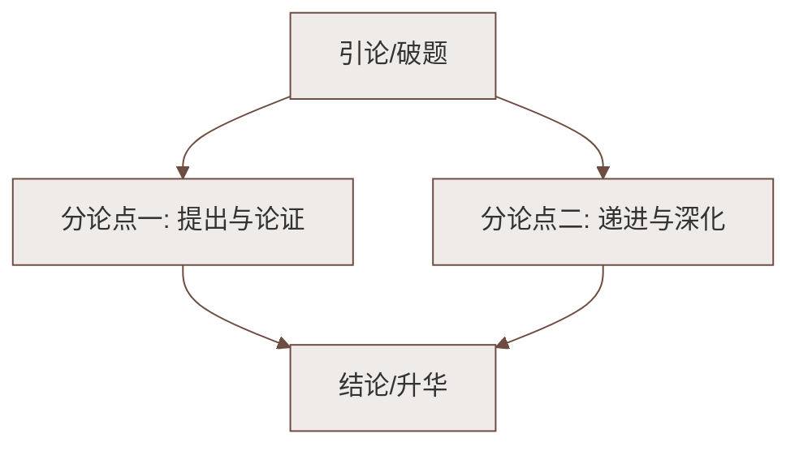

# 7 谁是最可爱的人

标签：#中考高频 #通讯 #抗美援朝

## 一、文学常识

| 项目 | 内容 |
|---|---|
| 作者 | 魏巍（1920—2008），当代作家，代表作长篇小说《东方》 |
| 出处 | 1951 年发表于《人民日报》，影响巨大 |
| 背景 | 抗美援朝战争，作者赴朝鲜前线采访 |
| 体裁 | 通讯（新闻性与文学性结合） |
| 影响 | "最可爱的人"从此成为志愿军战士的代称 |

## 二、课文结构：三个典型事例

1. **开头（第 1—3 段）**：抒情议论开篇——战士的品质、意志、气质、胸怀，点明"他们是最可爱的人"；
2. **主体：三个事例**
   - **松骨峰战斗**：与敌人殊死搏斗——表现**革命英雄主义**（对敌人的恨）；
   - **马玉祥火中救朝鲜儿童**：奋不顾身——表现**国际主义精神**（对朝鲜人民的爱）；
   - **防空洞谈话（吃雪战士）**：一问三答——表现**爱国主义精神**与崇高的苦乐观、荣誉观；
3. **结尾**：联系祖国人民的和平生活，呼应开头，再次点题"他们确实是我们最可爱的人"。

## 三、重点字词

| 字词 | 读音 | 释义 |
|---|---|---|
| 坚韧 | rèn | 坚固有韧性 |
| 淳朴 | chún pǔ | 诚实朴素 |
| 谦逊 | xùn | 谦虚恭谨 |
| 覆灭 | fù | 全部被消灭 |
| 摁 | èn | 用手按压 |
| 掰 | bāi | 用手把东西分开 |
| 豁亮 | huò | 宽敞明亮 |
| 憋闷 | biē mèn | 心里不舒畅 |
| 迸裂 | bèng | 破裂，裂开 |

（注：背默时重点掌握"坚韧、淳朴、谦逊、迸裂"四词。）

## 四、写法分析

1. **选材典型**：从大量素材中精选三个事例，分别对应"英雄主义—国际主义—爱国主义"三种精神，角度互补；
2. **叙事与抒情议论结合**：每个事例后都有抒情议论，或设问推进（"朋友，你是否意识到……"），感染力强；
3. **点面结合**：松骨峰战斗既有整体战况，又有烈士姓名的具体罗列，真实感人；
4. **第二人称呼告**："朋友"拉近与读者距离，引发共鸣。

## 五、主题思想

通过三个典型事例，赞颂志愿军战士**纯洁高尚的品质、坚韧刚强的意志、淳朴谦逊的气质、美丽宽广的胸怀**，
歌颂他们的革命英雄主义、国际主义和爱国主义精神，说明他们"确实是我们最可爱的人"。

## 六、练习题

1. 三个事例的顺序能否调换？
   > 不能。三者分别表现对敌之恨、对朝鲜人民之爱、对祖国之忠，由战斗到日常、由外到内，层层深入揭示"可爱"的内涵。
2. 防空洞谈话中战士的"三答"分别表现了什么？
   > 苦乐观（以苦为荣）、荣誉观（渴望立功报答祖国）、幸福观（为祖国人民吃苦是光荣）。
3. 文章开头结尾的抒情议论有什么作用？
   > 开篇点题、奠定感情基调；结尾呼应开头，升华主题，唤起读者共鸣。

## 七、知识联系

- 与[[6 老山界]]同写人民军队，一写长征、一写抗美援朝；
- 叙事中穿插抒情议论的写法是[[写作：学习抒情]]的典型示例；
- 家国情怀主线可关联[[5 黄河颂]][[8* 土地的誓言]]。

### 语文阅读与写作结构

