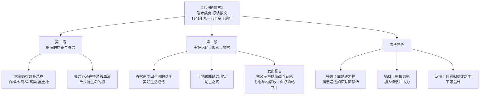

# 8* 土地的誓言

标签：#中考高频 #抒情散文 #家国情怀

## 一、文学常识

| 项目 | 内容 |
|---|---|
| 作者 | 端木蕻良（1912—1996），原名曹汉文，辽宁昌图人，"东北作家群"代表作家 |
| 代表作 | 《科尔沁旗草原》《大地的海》 |
| 背景 | 写于 1941 年"九一八"事变十周年，流亡关内的东北人怀念沦丧的故土 |
| 体裁 | 抒情散文 |
| 题意 | "土地的誓言"即"面对土地发出的誓言"，不是"土地自身发出的誓言" |

## 二、课文结构：两大段两层情感

1. **第一段**：我常常想起关东原野——"我"与故土之间**炽痛的热爱与眷念**：
   - 大量铺排故乡风物：白桦林、马群、高粱、豆粒、黑土地、山雕、鹿群、煤块……
   - "我的心还在喷涌着血液吧"——故乡是生命的根；
2. **第二段**：故乡美好的生活记忆（春秋两季田垄间的欢乐）→ 土地被践踏的现实 →
   **发出誓言**："我必定为她而战斗到底""你必须被解放！你必须站立！"

## 三、重点字词

| 字词 | 读音 | 释义 |
|---|---|---|
| 炽痛 | chì | 热烈而深切 |
| 嗥鸣 | háo | （野兽）大声嚎叫 |
| 斑斓 | bān lán | 灿烂多彩 |
| 谰语 | lán | 没有根据的话 |
| 怪诞 | dàn | 荒诞离奇 |
| 亘古 | gèn | 远古 |
| 默契 | qì | 双方不经商量而意见一致 |
| 田垄 | lǒng | 田埂 |
| 蚱蜢 | zhà měng | 一种昆虫 |
| 污秽 | huì | 肮脏的东西 |

## 四、写法与语言赏析

1. **呼告手法**：直接对土地以"你"相称（"土地，原野，我的家乡，你必须被解放"），情感由平静转为激越，直抒胸臆；
2. **铺排（列锦式罗列）**："参天碧绿的白桦林，标直漂亮的白桦树……"密集排列故乡意象，加大情感冲击力；
3. **人称变化**：对土地由"她"转为"你"，情感递进，如与故土对面倾诉；
4. **拟人**："我常常感到它在泛滥着一种热情"——"泛滥"写情感激荡奔涌、无法抑制；"埋葬过我的欢笑"——欢笑已死于沦陷，沉重悲愤。

## 五、主题思想

作者以倾诉式的语言，抒发对沦亡故土**炽痛的热爱与深切的怀念**，
表达**收复失地、解放家乡**的坚定誓言，洋溢着强烈的爱国深情。

## 六、练习题

1. 如何理解"我常常感到它在泛滥着一种热情"中的"泛滥"？
   > 本义江河水溢出，这里指思乡爱国之情如决堤之水不可遏制，比"洋溢"更强烈。
2. 文中列举大量故乡景物有什么作用？
   > 展现故乡的丰饶美丽，唤起读者共鸣，反衬故土沦丧的悲痛，蓄势为誓言。
3. 人称为什么由"她"变为"你"？
   > 情感越来越激动，改用第二人称直接倾诉，更直接、更强烈（呼告）。

## 结构图解

## 七、知识联系

- 与[[5 黄河颂]]同为抗战时期的家国抒怀名篇，呼告、反复等手法相通；
- 直接抒情与间接抒情的结合是[[写作：学习抒情]]的核心范例；
- 同单元[[6 老山界]][[7 谁是最可爱的人]]从军人角度表现家国情怀，本课从游子恋土角度切入。
