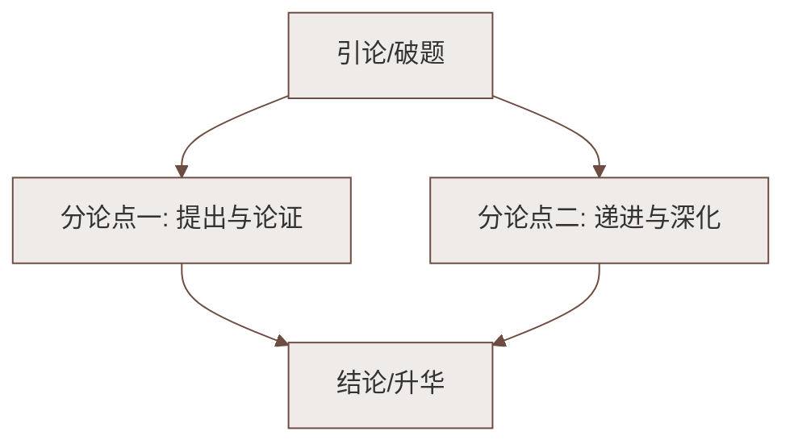

# 专题学习活动：我的语文生活

标签：#综合性学习 #语文实践

## 一、活动目标

1. 认识"生活处处有语文"：招牌、广告、对联都是语文的载体；
2. 在搜集、辨析、创作中提高语言文字运用能力；
3. 培养留心观察、规范用字的意识。

## 二、活动一：正眼看招牌

### 招牌的构成与类型
- 内容：店名＋经营范围（或特色说明）；
- 好店名的标准：**易读易记、切合行业、富有文化内涵、合法规范**；
- 常见手法：谐音（"食全食美"须注意是否规范）、用典、姓氏＋行业（"张记饺子"）。

### 实践要点
- 分组考察街区招牌，拍照记录；
- 辨析：哪些招牌有错别字、滥用谐音成语（如"衣衣不舍"）；
- 讨论：创意与规范如何平衡——正式场合须使用规范汉字。

## 三、活动二：我来写广告词

### 广告词的特点
| 特点 | 说明 | 示例 |
|---|---|---|
| 简洁凝练 | 一句话记得住 | "谁是最可爱的人"式的设问也可入广告 |
| 朗朗上口 | 讲究节奏押韵 | "钻石恒久远，一颗永流传" |
| 巧用修辞 | 双关、对偶、比喻、反复 | "默默无蚊（闻）"（注意规范争议） |
| 情感共鸣 | 打动人心 | 公益广告尤重情感 |

### 写作练习
- 为学校图书馆写一则公益广告：如"翻开一页书，走进一个世界"；
- 为家乡特产写广告词：突出特色、押韵易记。

## 四、活动三：寻找"最美对联"

### 对联基本常识（重点记忆）
1. **字数相等**，断句一致；
2. **词性相对**：名词对名词、动词对动词；
3. **平仄相协**：仄起平收（上联末字仄声，下联末字平声）；
4. **内容相关**：上下联意义关联，忌"合掌"（意思重复）；
5. 张贴：面对门时，**上联在右，下联在左**，横批从右往左（传统式）。

### 练习示例
- 上联"绿水本无忧，因风皱面"，对下联"青山原不老，为雪白头"；
- 收集家乡名胜、老字号对联并赏析。

## 五、成果整理与展示

1. 编辑《街头语文调查报告》：错别字、不规范用语照片＋修改建议；
2. 班级"广告词创作大赛"与"对联擂台"；
3. 写一篇活动感想，可用[[写作：学习抒情]]所学融入真情实感。

## 六、易错点提醒

- 对联"仄起平收"方向易记反；
- 广告谐音改成语（如"咳不容缓"）在规范用字场合属于不规范用法；
- 招牌调查要注明地点、时间，结论要有依据。

## 七、知识联系

- 语言的简明得体将在[[己亥杂诗其五／写作：语言要简明／整本书阅读：《钢铁是怎样炼成的》]]中继续学习；
- 对联的对偶知识与[[9 木兰诗]]中"朔气传金柝，寒光照铁衣"等对偶句相通；
- 观察生活、积累素材的习惯服务于[[写作：怎样选材]]。

### 语文阅读与写作结构

