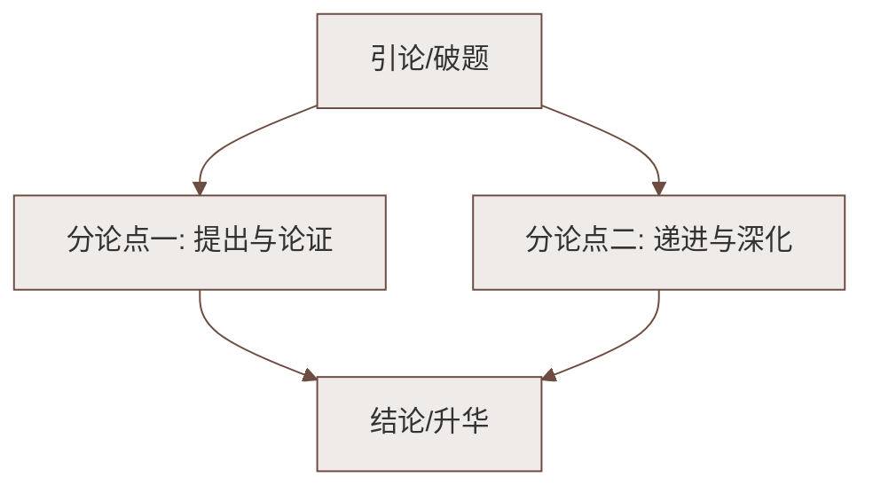

# 10 阿长与《山海经》

标签：#中考必考 #鲁迅 #回忆性散文 #欲扬先抑

## 一、文学常识

| 项目 | 内容 |
|---|---|
| 作者 | 鲁迅（1881—1936），原名周树人，浙江绍兴人，文学家、思想家、革命家 |
| 出处 | 散文集《朝花夕拾》（回忆性散文集，原名《旧事重提》） |
| 人物 | 阿长（长妈妈）：鲁迅儿时的保姆 |
| 双重视角 | "写作时的回忆"与"童年的感受"交织 |

## 二、课文结构与情节

1. **介绍阿长**（1—2 段）：名字来历——连名字都不属于自己，暗示地位卑微；
2. **"抑"的部分**（3—18 段）：
   - 喜欢切切察察、限制"我"行动；
   - 夏天睡觉摆"大"字（细节描写，粗俗率性）；
   - 元旦吃福橘、说"恭喜"的繁琐规矩；
   - 讲"长毛"的故事——"我"产生"特别的敬意"（诙谐）；
   - 谋害"我"的隐鼠——敬意消失，甚至憎恶；
3. **"扬"的部分**（19—29 段）：**买《山海经》**——
   - 远房叔祖引发渴慕，谁都不肯帮"我"；
   - 目不识丁的阿长主动买来"三哼经"；
   - "我"感到"确有伟大的神力"，产生"新的敬意"；
4. **结尾**（30—31 段）：补叙身世，深情祝祷——"仁厚黑暗的地母呵，愿在你怀里永安她的魂灵！"

## 三、重点字词

| 字词 | 读音 | 释义 |
|---|---|---|
| 憎恶 | zēng wù | 憎恨，厌恶 |
| 絮说 | xù | 絮絮叨叨地说 |
| 惶急 | huáng | 惊慌急迫 |
| 诘问 | jié | 追问，责问 |
| 渴慕 | mù | 非常思慕 |
| 疏懒 | shū lǎn | 懒散而不习惯于受拘束 |
| 霹雳 | pī lì | 又急又响的雷，文中指震惊 |
| 孤孀 | shuāng | 寡妇 |
| 掳 | lǔ | 把人抢走 |
| 震悚 | sǒng | 身体因恐惧或过度兴奋而颤动 |

## 四、写法分析

1. **欲扬先抑**：先写阿长种种"缺点"，后写买书的"伟大神力"，前后对照，使人物形象真实丰满，情感转变更有力量；
2. **详略得当**：略写规矩习惯，详写买《山海经》一事——最能体现阿长对"我"朴素的爱；
3. **双重叙述视角**：童年的"我"不耐烦、憎恶；成年的"我"同情、感激、怀念——文末抒情即成年视角；
4. **细节传神**："她穿着新的蓝布衫回来了……'哥儿，有画儿的"三哼经"，我给你买来了！'"——语言描写符合人物身份（不识字），朴实动人。

## 五、主题思想

文章围绕阿长记叙童年往事，刻画了一位**粗俗率性却淳朴善良、仁厚慈爱**的劳动妇女形象，
抒发了作者对长妈妈**深切的同情、感激与怀念**之情。

## 六、练习题

1. 题目为什么用"阿长"而不用"长妈妈"？
   > "阿长"是不客气的称呼，与前半部分"抑"的内容一致，还原儿时视角；与《山海经》并列又形成反差悬念。
2. "她确有伟大的神力"在文中出现两次，含义有何不同？
   > 前一次指"长毛"故事，是儿童的天真（含调侃）；后一次指买来《山海经》，是真诚的敬佩与感激。
3. 结尾一句表达了怎样的感情？
   > 深沉的祝祷，凝聚着对长妈妈的同情、感激与永久的怀念，升华全文。

## 七、知识联系

- 欲扬先抑手法与[[3* 列夫·托尔斯泰]]相同，可对比；
- 同单元[[12* 台阶]][[11 山地回忆（孙犁）]]同写"小人物"的光辉；
- 细节描写的功力可迁移到[[写作：抓住细节]]。

### 语文阅读与写作结构

