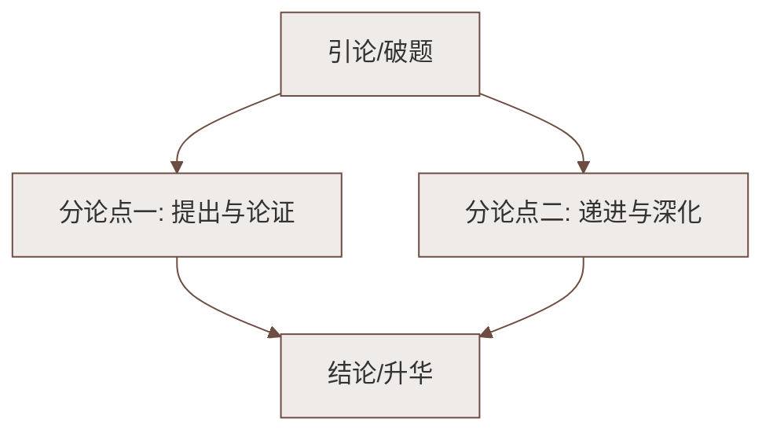

# 11 山地回忆（孙犁）

标签：#中考高频 #小说 #荷花淀派 #军民情谊

## 一、文学常识

| 项目 | 内容 |
|---|---|
| 作者 | 孙犁（1913—2002），河北安平人，现当代作家，"荷花淀派"创始人 |
| 代表作 | 《荷花淀》《芦花荡》，小说散文集《白洋淀纪事》 |
| 风格 | 诗化小说：清新自然、简洁明快，于战争题材中写人情美、人性美 |
| 背景 | 抗日战争时期晋察冀边区（阜平山地）的军民生活 |

## 二、情节梳理（回忆结构）

1. **现实引子**：在天津遇到阜平来的农民代表，回想起山地岁月与"一双袜子"；
2. **河边相识**："我"在河边洗脸，与妞儿"吵嘴"相识——妞儿伶牙俐齿、直率泼辣；
3. **做袜子**：妞儿主动提出给"我"做袜子——白布"洋线"袜，纳了底子，"很结实"；
4. **交往加深**：帮女孩家撕棉花、贩红枣，两家结下情谊；
5. **袜子的结局**：袜子穿了多年，最后在战斗行军中丢于大水；
6. **尾声回到现实**：给妞儿一家捎去布匹，情谊延续。

## 三、人物形象：妞儿

- **直率泼辣**：初见就"骂"人——"你看不见我在这里洗菜吗？"
- **心地善良、爽快利落**：嘴上不饶人，转身就要给"我"做袜子；
- **勤劳能干**：洗菜、做袜、纺织样样在行；
- **深明大义**：对八路军战士真诚关切，体现根据地人民对子弟兵的爱。

## 四、重点字词

| 字词 | 读音 | 释义 |
|---|---|---|
| 土靛 | diàn | 一种蓝色染料 |
| 破绽 | zhàn | 衣物裂口，比喻漏洞 |
| 袄 | ǎo | 有里子的上衣 |
| 浸湿 | jìn | 泡湿 |
| 盈余 | yíng | 收入中除去开支后剩余的部分 |
| 玉米糁 | shēn | 玉米碎粒 |
| 刨抓 | páo | 挖掘，文中指劳作谋生 |

## 五、写法分析

1. **以小见大**：一双袜子串起全篇（线索），小物件承载军民鱼水深情、时代大主题；
2. **对话描写生动传神**：人物语言个性化、口语化，"吵嘴"开场先抑后扬，妞儿形象跃然纸上；
3. **倒叙结构**：由现实引出回忆，首尾呼应，今昔情谊绵延；
4. **清新的乡土气息**：洗菜、纺线、贩枣等生活场景，战争背景下的诗意书写（荷花淀派特色）。

## 六、主题思想

小说以"一双袜子"为线索，回忆抗战时期"我"与阜平山地一家农民的交往，
表现了**根据地人民的勤劳善良**和**真挚深厚的军民情谊**，赞美了战争年代普通人身上的人情美、人性美。

## 七、练习题

1. 小说为什么从"阜平蓝的时兴"写起？
   > 由现实之物引出回忆（倒叙），自然亲切，也暗示山地生活对"我"影响之深。
2. 妞儿"骂人"的开场是否有损形象？
   > 不损。欲扬先抑，正显其直率天真；后文做袜子的热心与之对照，人物更真实可爱。
3. "袜子"在文中有什么作用？
   > 全文线索；军民情谊的见证与象征；推动情节发展。

## 八、知识联系

- 与[[10 阿长与《山海经》]]同写平凡人物的美好心灵，都用了先抑后扬；
- 同单元[[12* 台阶]]写农民父亲，可比较小人物形象塑造；
- 个性化对话、生活化细节是[[写作：抓住细节]]的示范。

### 语文阅读与写作结构

