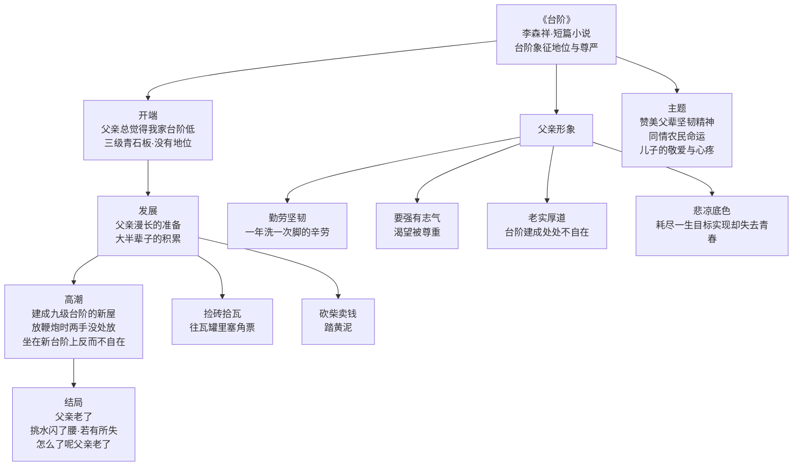

# 12* 台阶

标签：#中考高频 #小说 #父亲形象 #象征

## 一、文学常识

| 项目 | 内容 |
|---|---|
| 作者 | 李森祥（1956— ），浙江衢州人，当代作家 |
| 出处 | 小说集《台阶》 |
| 体裁 | 短篇小说（第一人称叙述） |
| 关键意象 | "台阶"——地位的象征："台阶高，屋主人的地位就相应高" |

## 二、情节梳理

1. **开端**：父亲总觉得我家台阶低——三级青石板台阶，"没人说过他有地位，父亲也从没觉得自己有地位"；
2. **发展**：父亲漫长的准备——捡砖拾瓦、往瓦罐里塞角票、砍柴卖钱、踏黄泥……大半辈子的积累；
3. **高潮**：建成九级台阶的新屋——放鞭炮时父亲双手"不知放在哪里"，坐在新台阶上反而"不自在"；
4. **结局**：父亲老了——挑水闪了腰，"若有所失"，"怎么了呢，父亲老了"。

## 三、父亲形象分析

| 特点 | 具体表现 |
|---|---|
| 勤劳坚韧 | 大半辈子捡砖、砍柴、积攒，一年洗一次脚的辛劳 |
| 要强有志气 | 不甘台阶低，渴望被尊重，有长远目标 |
| 老实厚道 | 低调谦卑，台阶建成反而处处不自在 |
| 悲凉底色 | 为理想耗尽一生，目标实现却失去了青春与健康 |

## 四、重点字词

| 字词 | 读音 | 释义 |
|---|---|---|
| 凹凼 | āo dàng | 方言，水坑 |
| 门槛 | kǎn | 门框下端的横木 |
| 涎水 | xián | 口水 |
| 揩 | kāi | 擦，抹 |
| 嘎嘎 | gā | 拟声词 |
| 筹划 | chóu | 想办法，定计划 |
| 尴尬 | gān gà | 神色、态度不自然 |
| 大庭广众 | tíng | 人很多的公开场合 |
| 微不足道 | wēi | 非常渺小，不值一提 |

## 五、写法与细节赏析

1. **围绕"台阶"组材**：台阶是线索，也是父亲毕生追求的象征，凸显主题；
2. **细节描写传神**：
   - "专注地望着别人家高高的台阶"——渴望之深；
   - 洗脚"洗出一盆泥浆"——终年劳作的艰辛；
   - 放鞭炮时"两手没处放"——老实谦卑，不习惯"体面"；
3. **第一人称视角**：儿子的观察与体察，含蓄流露心疼与敬意；
4. **结尾留白**："怎么了呢，父亲老了。"平淡语句蕴含无限怅惘。

## 六、主题思想

小说塑造了一位**勤劳、要强、老实厚道**的农民父亲形象：他用大半生的辛劳建成九级台阶的新屋，实现了对尊重的渴望，却也耗尽了生命的活力。
作品既**赞美父辈坚韧不拔的精神**，又饱含对农民命运的**同情与思考**，流露出儿子对父亲深深的**敬爱与心疼**。

## 七、练习题

1. "台阶"在小说中有哪些含义？
   > 实指屋前的台阶；虚指地位、尊严，是父亲毕生追求的目标（象征）。
2. 新屋建成后父亲为什么反而"不自在"？
   > 长期的谦卑劳作已成习惯，地位的改变无法立刻改变心理；也暗示追求实现后的失落。
3. 如何理解结尾"父亲老了"？
   > 台阶筑成，青春耗尽；平静叙述中含有辛酸、敬意与怅惘，引人深思。

## 结构图解

## 八、知识联系

- 与[[10 阿长与《山海经》]][[11 山地回忆（孙犁）]]同属"小人物"单元，比较三种平凡人的光辉；
- 细节描写（洗脚、放鞭炮）是[[写作：抓住细节]]的极佳范例；
- 农民命运主题可联系[[整本书阅读：《骆驼祥子》]]中祥子的奋斗与幻灭。
