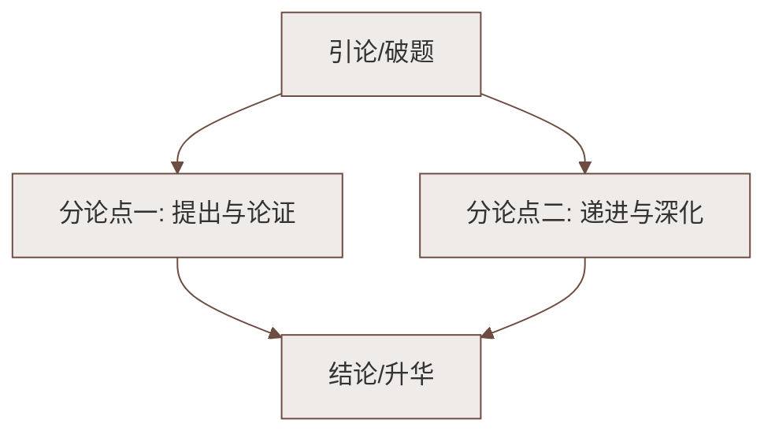

# 13 卖油翁

标签：#中考必考 #文言文 #熟能生巧

## 一、文学常识

| 项目 | 内容 |
|---|---|
| 作者 | 欧阳修（1007—1072），字永叔，号醉翁，晚号六一居士 |
| 身份 | 北宋政治家、文学家，"唐宋八大家"之一 |
| 出处 | 《归田录》（笔记小说） |
| 体裁 | 笔记体短篇故事 |

## 二、课文要点与情节

1. **陈尧咨善射**："当世无双"，因此"自矜"（自夸）；
2. **卖油翁观射**："释担而立""睨之久而不去"，见其发矢十中八九，"但微颔之"；
3. **两人对话冲突**：康肃问"吾射不亦精乎？"翁答"无他，但手熟尔"，康肃"忿然"；
4. **酌油示技**：置葫芦、覆铜钱，"徐以杓酌油沥之，自钱孔入，而钱不湿"；
5. **点明道理**："我亦无他，惟手熟尔。"康肃"笑而遣之"。

## 三、重点字词（文言积累）

| 词句 | 释义 |
|---|---|
| 善射 | 擅长 |
| **自矜** | 自夸 |
| **释**担而立 | 放下 |
| **睨**之久而不去 | 斜着眼看，形容不在意的样子（nì） |
| 但微**颔**之 | 点头（hàn） |
| 尔安敢**轻**吾射 | 轻视（形容词作动词） |
| 以我**酌**油知之 | 舀取，这里指倒入 |
| 以钱**覆**其口 | 盖 |
| **徐**以杓酌油沥之 | 慢慢地（杓：同"勺"） |
| 惟手熟**尔** | 同"耳"，罢了 |
| 康肃笑而**遣**之 | 打发 |

**古今异义**：但手熟尔（但，古：只；今：转折连词）；尔安敢轻吾射（安，古：怎么；今：安全）。

## 四、重点句翻译

1. 见其发矢十中八九，但微颔之。
   > （卖油翁）看他射箭十支中八九支，只是微微点头。
2. 无他，但手熟尔。
   > 没有别的（奥妙），只不过手法熟练罢了。
3. 徐以杓酌油沥之，自钱孔入，而钱不湿。
   > 慢慢地用勺舀油注入（葫芦），（油）从钱孔进入，而钱却没有湿。

## 五、人物形象与写法

- **陈尧咨**：善射自矜、骄横暴躁（"忿然"），但尚能服理（"笑而遣之"）；
- **卖油翁**：身怀绝技却谦虚沉着，以事实说话；
- **写法**：①对比鲜明（自矜与沉稳）；②详略得当（详写酌油，略写射箭）；③神态动词传神——"睨""微颔""忿然""笑"寥寥数字见性格。

## 六、主题思想

通过卖油翁以酌油绝技回应陈尧咨的善射自夸，说明**熟能生巧**的道理，
告诫人们：即使有长处也不应骄傲自满，**技艺专长皆从勤学苦练中来**。

## 七、练习题

1. "睨之""但微颔之"表现了卖油翁怎样的心理？
   > 见惯不惊、并不十分赞赏，暗示"手熟"而已，为下文张本。
2. 卖油翁酌油的细节描写有什么作用？
   > 以精湛技艺证明"手熟"之理，事实胜于雄辩，使康肃心服。
3. 这个故事给你什么启示？
   > 熟能生巧；山外有山，不可自满自夸；用实力与事实说话。

## 八、知识联系

- 与[[4 孙权劝学]]同讲成长道理：一是"学"，一是"练"；
- 文言实词积累可与[[17 短文两篇（陋室铭；爱莲说）]][[25 活板]]滚动复习；
- 用细节（动作神态）刻画人物的方法呼应[[写作：抓住细节]]。

### 语文阅读与写作结构

