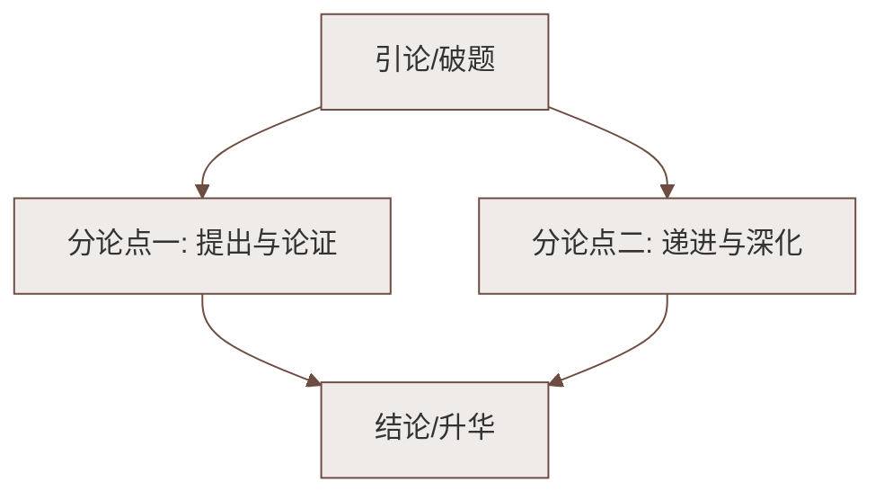

# 整本书阅读：《骆驼祥子》

标签：#中考必考 #名著导读 #老舍 #京味小说

## 一、作品概况

| 项目 | 内容 |
|---|---|
| 作者 | 老舍（1899—1966），原名舒庆春，字舍予，北京人，"人民艺术家" |
| 代表作 | 《骆驼祥子》《四世同堂》，话剧《茶馆》《龙须沟》 |
| 体裁 | 长篇小说（1936 年发表） |
| 语言特色 | 京味十足、通俗鲜活，善用北京口语 |
| 主线 | 祥子买车的"三起三落" |

## 二、情节主线：三起三落

| 阶段 | 起 | 落 |
|---|---|---|
| 第一次 | 苦干三年攒钱买了新车 | 连人带车被大兵抢走（乱兵） |
| 第二次 | 卖骆驼、拼命拉车再攒钱 | 攒的钱被孙侦探敲诈一空 |
| 第三次 | 用虎妞的钱买了车 | 虎妞难产而死，卖车安葬 |

**堕落轨迹**：小福子自尽后，祥子彻底绝望——吃喝嫖赌、出卖他人，从"体面的、要强的"车夫沦为"堕落的、自私的、不幸的，社会病胎里的产儿，个人主义的末路鬼"。

## 三、主要人物形象

- **祥子**：前期老实健壮、坚忍要强、有骏马般的梦想；后期麻木潦倒、自暴自弃——个人奋斗在黑暗社会中幻灭的典型；
- **虎妞**：车厂主刘四爷之女，泼辣精明、敢爱敢恨，又有剥削者的习气；诱婚祥子，难产而死；
- **刘四爷**：残忍霸道的车厂主，为面子不认女儿；
- **小福子**：善良悲苦的底层女子，祥子最后的精神寄托，其死成为祥子堕落的最后一击；
- **曹先生**：正直的知识分子，被祥子视为"圣人"；
- **孙侦探**：敲诈祥子买车钱的爪牙，黑暗势力的缩影。

## 四、主题思想

通过祥子"精进向上—不甘失败—自甘堕落"的命运三部曲，
**揭露旧中国黑暗社会对劳动者的压榨与摧残**，批判"个人奋斗"道路的局限，
表达对底层劳动人民深切的同情。

## 五、艺术特色

1. **京味语言**：北京口语、儿化词，鲜活地道（如写洋车夫的"拉晚儿""嚼谷"）；
2. **心理描写细腻**：大量笔墨写祥子的内心挣扎与蜕变；
3. **环境烘托**：烈日暴雨下拉车一节（"六月十五那天"）是环境描写经典段落；
4. **悲剧结构**：三起三落层层推进，希望与打击交替，命运感强烈。

## 六、中考常考题点

1. "骆驼祥子"称号的来历？
   > 祥子被乱兵抓走后牵回三匹骆驼卖了 35 元，从此得名"骆驼祥子"。
2. 祥子堕落的原因？
   > 根本原因：黑暗腐败的社会制度；直接原因：三起三落的打击、虎妞之死、小福子之死；自身原因：个人奋斗的局限与性格弱点。
3. 圈点批注读书法：在关键情节（如烈日暴雨拉车）旁批注人物心理与环境作用。

## 七、阅读方法指导

- **圈点与批注**：标记精彩语句，写下即时感受与疑问；
- **梳理情节线**：以"车"为线索画出三起三落结构图；
- **专题探究**：①祥子的"梦想清单"与破灭过程；②京味语言摘抄；③女性人物（虎妞、小福子）命运比较。

## 八、知识联系

- 农民/车夫的奋斗悲歌与[[12* 台阶]]中的父亲可作比较：同为要强的底层劳动者；
- 环境描写烘托人物的手法可迁移至[[19 紫藤萝瀑布]]等写景课文的学习；
- 下一部必读名著见[[己亥杂诗其五／写作：语言要简明／整本书阅读：《钢铁是怎样炼成的》]]。

### 语文阅读与写作结构

