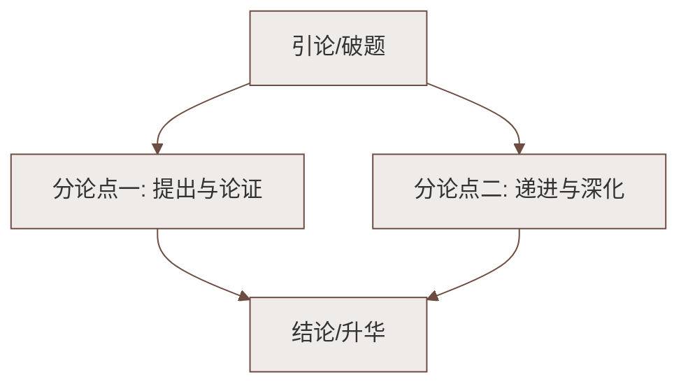

# 课外古诗词诵读：竹里馆／春夜洛城闻笛／逢入京使／晚春

标签：#中考必考 #古诗词 #背诵默写

## 一、《竹里馆》——王维

> 独坐幽篁里，弹琴复长啸。深林人不知，明月来相照。

- **作者**：王维（701—761），字摩诘，盛唐山水田园诗人，"诗佛"，苏轼评"诗中有画，画中有诗"；
- **出处**：《辋川集》二十首之一；
- **炼字**："独"字贯穿全诗——独坐、弹琴、长啸，却不孤独；
- **手法**：拟人（"明月来相照"，明月似知音）；以声衬静（琴啸反衬幽静）；
- **情感**：宁静淡泊、超然物外的隐居之乐；
- **默写高频**：深林人不知，明月来相照。

## 二、《春夜洛城闻笛》——李白

> 谁家玉笛暗飞声，散入春风满洛城。此夜曲中闻折柳，何人不起故园情。

- **作者**：李白（701—762），字太白，号青莲居士，"诗仙"；
- **炼字**："暗"写笛声不知从何处悄然飞来；"散""满"写笛声随风传遍全城（夸张）；
- **关键意象**："折柳"即《折杨柳》曲，古人临别折柳相赠，"柳"谐音"留"，寓惜别怀远之意；
- **情感**：闻笛而起的**思乡之情**（故园情）；
- **默写高频**：此夜曲中闻折柳，何人不起故园情。

## 三、《逢入京使》——岑参

> 故园东望路漫漫，双袖龙钟泪不干。马上相逢无纸笔，凭君传语报平安。

- **作者**：岑参（约 715—770），盛唐**边塞诗人**，与高适并称"高岑"；
- **背景**：诗人赴安西途中，逢返京使者，托带口信；
- **字词**：龙钟——泪流纵横的样子；凭——请求，烦劳；传语——捎口信；
- **手法**：前两句夸张写思乡之切；后两句白描，"马上相逢"的行色匆匆见真情；
- **情感**：思乡怀亲与**报国壮志**并存，深情而不哀伤；
- **默写高频**：马上相逢无纸笔，凭君传语报平安。

## 四、《晚春》——韩愈

> 草树知春不久归，百般红紫斗芳菲。杨花榆荚无才思，惟解漫天作雪飞。

- **作者**：韩愈（768—824），字退之，世称韩昌黎，"唐宋八大家"之首，倡导古文运动；
- **手法**：**拟人**通篇——草木"知"春、"斗"芳菲，杨花榆荚"无才思""惟解"；
- **理趣**：杨花榆荚虽无艳色，也不甘寂寞漫天飞舞——珍惜时光、乘时而进；一说含对"无才思"者的调侃，鼓励人抓住机遇展示自我；
- **情感**：惜春、赞春，蕴含积极进取的人生态度；
- **默写高频**：杨花榆荚无才思，惟解漫天作雪飞。

## 五、四首对比总表

| 诗题 | 作者 | 题材 | 核心情感 | 主要手法 |
|---|---|---|---|---|
| 竹里馆 | 王维 | 隐居 | 宁静淡泊 | 以声衬静、拟人 |
| 春夜洛城闻笛 | 李白 | 思乡 | 故园之思 | 夸张、用典（折柳） |
| 逢入京使 | 岑参 | 边塞思乡 | 思亲＋报国 | 夸张、白描 |
| 晚春 | 韩愈 | 咏物哲理 | 惜时进取 | 拟人、理趣 |

## 六、练习题

1. 《竹里馆》"明月来相照"用了什么手法？有何妙处？
   > 拟人，把明月当作知己，写出诗人与自然相融的宁静自得。
2. "此夜曲中闻折柳"的"折柳"指什么？为何能引发故园情？
   > 指《折杨柳》曲；折柳赠别的习俗使笛曲带上离愁，引发思乡。
3. 《晚春》中"无才思"的杨花榆荚给你什么启示？
   > 不因平凡而自弃，抓住时机、尽展所能。

## 七、知识联系

- 本册另一组诵读诗见[[课外古诗词诵读：泊秦淮／贾生／过松源晨炊漆公店（其五）／约客]]；
- 哲理诗的读法与[[登飞来峰]][[游山西村]]相通；
- 王维的"诗中有画"可与[[望岳]]的写景手法比较。

### 语文阅读与写作结构

