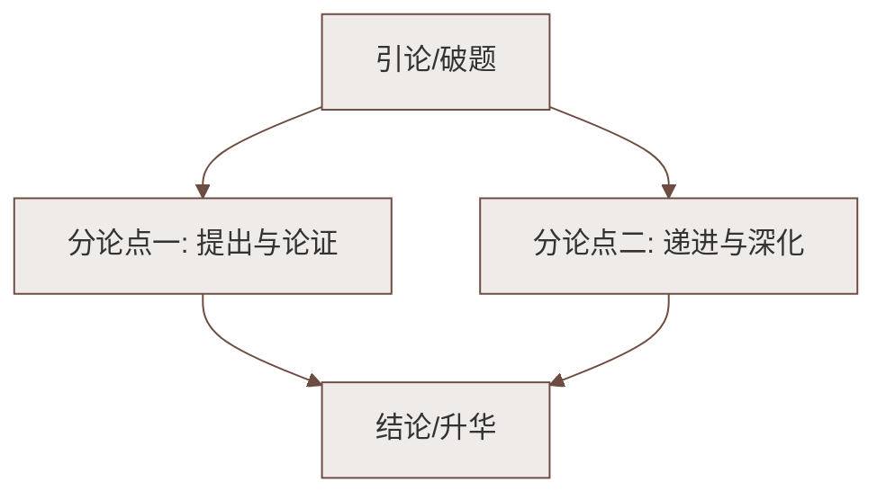

# 16* 有为有不为（季羡林）

标签：#中考高频 #议论性散文 #修身立德

## 一、文学常识

| 项目 | 内容 |
|---|---|
| 作者 | 季羡林（1911—2009），山东临清人，学者、翻译家、散文家 |
| 身份 | 北京大学教授，精通梵文、吐火罗文等，学贯中西 |
| 代表作 | 《牛棚杂忆》《病榻杂记》，散文《清塘荷韵》 |
| 体裁 | 议论性散文（谈修身道理） |
| 文风 | 平实质朴，如话家常，而道理深刻 |

## 二、课文思路梳理

1. **释题**：什么叫"有为有不为"——"为"就是"做"；**应该做的事必须去做（有为），不应该做的事必不能做（有不为）**；
2. **判断标准**：什么算"应该"？——不必读高深伦理学著作，凭**良知良能**（人人皆有的是非之心）即可判断，如"公共汽车上让座是善，抢劫是恶"；
3. **善恶有大小之分**：
   - 小善小恶：日常生活中常见，如让座与否；
   - 大善大恶：关系国家民族，如文天祥慷慨殉国是大善；
   - 二者关系：**大小之间有联系——"勿以恶小而为之，勿以善小而不为"（引刘备语）**，小恶不断会发展成大恶；
4. **结论**：每个人都应"有为有不为"；一旦"为"错了，就要**毅然回头**（"浪子回头金不换"）。

## 三、重点字词

| 字词 | 读音 | 释义 |
|---|---|---|
| 诉诸 | zhū | 求助于（"诸"＝之于） |
| 良知良能 | — | 人天生的道德意识与向善能力 |
| 笼统 | lǒng tǒng | 缺乏具体分析，不明确 |
| 界限 | xiàn | 不同事物的分界 |
| 轻而易举 | — | 形容事情很容易做 |
| 贻害无穷 | yí | 留下无穷祸害 |
| 毅然 | yì | 坚决地 |
| 迷途知返 | fǎn | 迷路后知道回来，比喻知错能改 |

## 四、论证方法与语言特色

1. **引用论证**：引"勿以恶小而为之，勿以善小而不为"，精辟点明小善小恶与大善大恶的联系；
2. **举例论证**：让座（小善）、文天祥殉国（大善），例子贴近生活或人所共知，浅显有力；
3. **对比论证**：善与恶、大与小、为与不为对举，界限分明；
4. **语言平易近人**：口语化表达（"哪里用得着读什么伦理学著作"），大学者写小文章，深入浅出。

## 五、主题思想

文章围绕"有为有不为"展开，指出**应做之事必须做，不应做之事必不做**，
判断标准在于人人皆有的良知；勉励人们**从小事做起，明辨善恶，防微杜渐**，
错了则迷途知返，做一个有道德操守的人。

## 六、练习题

1. 标题"有为有不为"中的"为"是什么意思？整个标题如何理解？
   > "为"即"做"。应该做的事必须去做，不应该做的事必不能做。
2. 作者认为区分"应该不应该"的标准是什么？
   > 良知良能——人人皆有的是非善恶之心，不必求诸高深理论。
3. 文中引用"勿以恶小而为之，勿以善小而不为"有什么作用？
   > 引用论证，说明小善小恶与大善大恶相通，劝人从小事上坚守善、拒绝恶，增强说服力。

## 七、知识联系

- 与[[15 青春之光（祝红蕾，黄文秀事迹）]]呼应："有为"的最高境界是为国为民的大善；
- 与[[17 短文两篇（陋室铭；爱莲说）]]同讲修身：一议论明理，一托物言志；
- 洁身自好、坚守底线的主题亦见于[[整本书阅读：《骆驼祥子》]]中祥子堕落的反面警示。

### 语文阅读与写作结构

