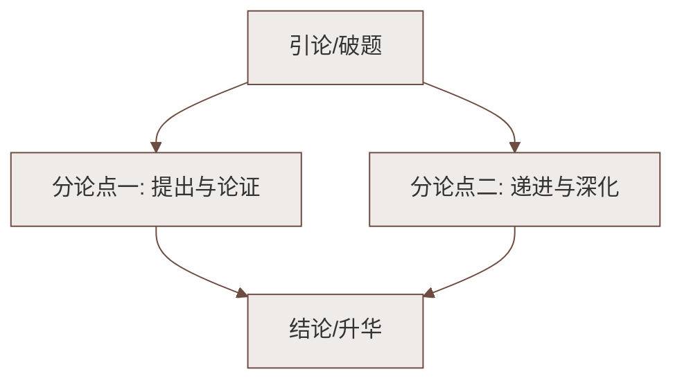

# 专题学习活动：孝亲敬老，传承家风

标签：#综合性学习 #传统美德 #口语交际

## 一、活动目标

1. 理解"孝亲敬老"这一中华传统美德的内涵与现代意义；
2. 在策划、采访、写作等活动中提高语文综合运用能力；
3. 从身边做起，用行动孝亲敬老，传承良好家风。

## 二、知识积累："孝"的文化

### 1. "孝"字溯源
- 甲骨文的"孝"：上为"老"省形，下为"子"——**子女搀扶老人**之意；
- 《说文解字》："孝，善事父母者。"

### 2. 经典名言（默写常考）
- 子曰："父母之年，不可不知也。一则以喜，一则以惧。"（《论语》）
- "老吾老，以及人之老；幼吾幼，以及人之幼。"（《孟子》）
- "谁言寸草心，报得三春晖。"（孟郊《游子吟》）
- "亲尝汤药""卧冰求鲤"等"二十四孝"故事（注意辨析：取其敬爱之心，摒弃愚孝糟粕）。

### 3. 孝的现代内涵
- 物质赡养 ＋ **精神陪伴**（常回家看看、耐心倾听）；
- 尊重长辈意愿，而非盲从；
- 敬老由家庭推及社会（让座、志愿服务）。

## 三、活动设计

### 活动一：制订"孝亲敬老月"方案
- 拟定活动名称、口号（如"孝在心，更在行"）；
- 安排系列活动：主题班会、感恩家书、为长辈做一件事打卡。

### 活动二：采访长辈，记录家风
- 采访提纲示例：您小时候家里有哪些规矩？哪句话对您影响最大？
- 整理成《我家的家风故事》，注意记录口语中的鲜活表达。

### 活动三：为长辈做一件事
- 做一顿饭、洗一次脚、教长辈用手机、陪散步聊天；
- 写活动感受，融入真情实感（参考[[写作：学习抒情]]）。

## 四、口语交际要点

- **称呼得体**：对长辈用敬辞（您、请、劳驾）；
- **倾听为先**：不打断，用点头回应；
- **劝说有方**：长辈观念不同（如舍不得花钱），先肯定再建议，语气委婉。

## 五、写作衔接

1. 写人：以《我的爷爷/奶奶》为题，运用[[写作：写出人物特点]]所学抓典型细节；
2. 记事：写"为长辈做一件事"的经过，注意[[写作：抓住细节]]中的动作分解；
3. 家书：格式规范（称呼顶格、问候语、署名日期），情感真挚。

## 六、易错点提醒

- "孝亲敬老"不等于百依百顺，要区分"孝"与"愚孝"；
- 引用《论语》《孟子》名句默写时注意"寸草心""三春晖"等易错字；
- 采访记录须忠实原意，整理时不可随意改动长辈的观点。

## 七、知识联系

- 家庭亲情主题呼应[[10 阿长与《山海经》]][[12* 台阶]]中的长辈形象；
- 修身立德与[[16* 有为有不为（季羡林）]]"应该做的事必须去做"一致；
- 综合性学习方法可参考[[专题学习活动：我的语文生活]]。

### 语文阅读与写作结构

