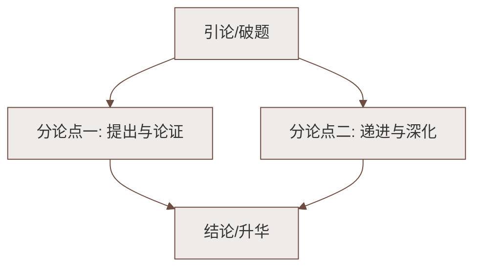

# 20* 外国诗二首（假如生活欺骗了你；未选择的路）

标签：#中考高频 #外国诗歌 #哲理诗

## 一、《假如生活欺骗了你》——普希金

### 文学常识
| 项目 | 内容 |
|---|---|
| 作者 | 普希金（1799—1837），俄国伟大诗人，"俄罗斯文学之父""俄罗斯诗歌的太阳" |
| 代表作 | 《自由颂》《致大海》《叶甫盖尼·奥涅金》 |
| 背景 | 写于流放期间，题赠邻居家的小姑娘 |

### 内容要点
- **第一节**：面对"生活的欺骗"（挫折困境）——"不要悲伤，不要心急！忧郁的日子里须要镇静：相信吧，快乐的日子将会来临"；
- **第二节**：阐述哲理——"心儿永远向往着未来；现在却常是忧郁。一切都是瞬息，一切都将会过去；而那过去了的，就会成为亲切的怀恋"。

### 特色与主题
1. 直抒胸臆，没有具体形象，以**劝说口吻**讲人生哲理，亲切热诚；
2. 主题：面对挫折要**镇静乐观**，坚信未来光明；苦难终将过去，回忆反而亲切；
3. 名句默写：而那过去了的，就会成为亲切的怀恋。

## 二、《未选择的路》——弗罗斯特

### 文学常识
| 项目 | 内容 |
|---|---|
| 作者 | 弗罗斯特（1874—1963），美国诗人，四获普利策奖，被称为"新英格兰的农民诗人" |
| 特色 | 常以自然景物入诗，朴素中含深刻哲理 |

### 内容层次（四节）
1. **伫立岔路**：黄色的树林里分出两条路，"可惜我不能同时去涉足"——人生抉择的困惑；
2. **选择荒径**：选了"荒草萋萋，十分幽寂"、更少人走的一条——不随俗、有个性的选择；
3. **难以回返**："路径延绵无尽头，恐怕我难以再回返"——选择的不可逆；
4. **多年后叹息**："一片树林里分出两条路——而我选择了人迹更少的一条，从此决定了我一生的道路。"

### 特色与主题
1. **象征手法**：自然之路象征**人生之路**；全诗重点是"未选择的路"——引发对选择的珍视与深思；
2. 主题：人生道路的选择须**慎重独立**；选择一旦做出便无法重来，要勇于走自己的路，也坦然面对不能兼得的遗憾。

## 三、两诗比较

| 项目 | 假如生活欺骗了你 | 未选择的路 |
|---|---|---|
| 表现手法 | 直抒胸臆（无形象说理） | 象征（借路说人生） |
| 语气 | 劝慰、鼓励 | 深思、怅惘 |
| 哲理 | 乐观面对挫折 | 慎重对待选择 |

## 四、重点字词

| 字词 | 读音 | 释义 |
|---|---|---|
| 瞬息 | shùn xī | 一眨眼一呼吸的短时间 |
| 怀恋 | liàn | 怀念，留恋 |
| 涉足 | shè | 进入某种环境或范围 |
| 萋萋 | qī | 形容草长得茂盛 |
| 幽寂 | jì | 幽静寂寞 |
| 延绵 | yán mián | 延续不断 |

## 五、练习题

1. 怎样理解"生活欺骗了你"？
   > 指遭遇挫折不幸、理想与现实的落差，是诗人流放中切身的人生体验。
2. 《未选择的路》为何重点写"未选择"的那条路？
   > 未选择的路引人遐想与怅惘，更能引发对"选择"意义的思考，突出选择之慎重与不可逆。
3. 两首诗分别给你怎样的人生启示？
   > 前者：身处逆境保持乐观镇静；后者：面对抉择独立思考、敢于走人迹更少的路。

## 六、知识联系

- 直面不幸、拥抱生命的主题与[[19 紫藤萝瀑布]]相通；
- 象征（路→人生）可联系[[18 井冈翠竹（袁鹰）]]的托物言志；
- 逆境奋起的形象注脚见[[己亥杂诗其五／写作：语言要简明／整本书阅读：《钢铁是怎样炼成的》]]中保尔的成长。

### 语文阅读与写作结构

