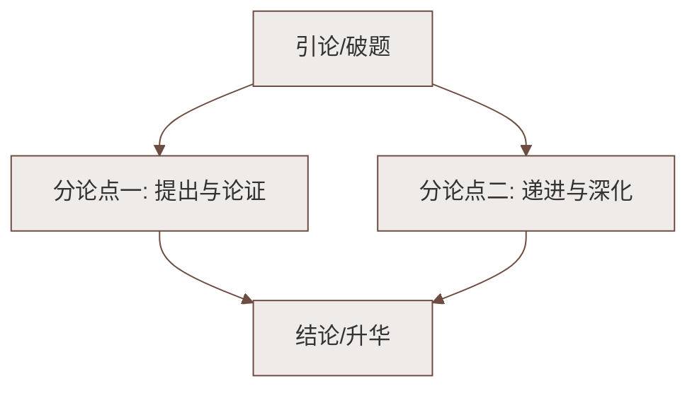

# 登幽州台歌

标签：#中考必考 #古诗 #背诵默写 #怀才不遇

## 一、原诗

> 前不见古人，后不见来者。
> 念天地之悠悠，独怆然而涕下！

## 二、文学常识

| 项目 | 内容 |
|---|---|
| 作者 | 陈子昂（661—702），字伯玉，梓州射洪人，初唐诗人 |
| 地位 | 初唐诗歌革新的先驱，主张恢复汉魏风骨，一扫齐梁绮靡诗风 |
| 幽州台 | 即蓟北楼，战国燕昭王为招纳贤士所建"黄金台"，故址在今北京 |
| 背景 | 武则天万岁通天元年，陈子昂随武攸宜征契丹，屡献奇计不被采纳反遭贬抑，登台悲歌 |

## 三、逐句赏析

**"前不见古人，后不见来者。"**
- "古人"指燕昭王那样礼贤下士的明君，"来者"指后世的贤明之主；
- 俯仰古今，写出**时间的绵长**；两个"不见"，道尽生不逢时、无人赏识的孤独悲愤。

**"念天地之悠悠，独怆然而涕下！"**
- "悠悠"写**空间的辽阔**（天地苍茫无垠）；
- 一个"**独**"字是全诗诗眼：天地愈大，个人愈显渺小孤单；
- "怆然涕下"直抒胸臆，悲怆之情喷涌而出。

## 四、艺术特色

1. **时空对照**：前两句纵观古今（时间），第三句放眼天地（空间），在阔大背景下凸显个体的孤独，意境雄浑；
2. **直抒胸臆**：不借具体景物，纯以感喟成诗，感情深沉激越；
3. **句式长短参差**：前两句五字急促，后两句六字（加"之""而"）舒缓，抑扬变化中见悲慨（楚辞体式）；
4. 短短四句、二十二字，成为千古"**怀才不遇**"主题的绝唱。

## 五、重点字词

| 字词 | 读音/释义 |
|---|---|
| 悠悠 | 形容时间久远、空间广大 |
| 怆然 | chuàng，悲伤的样子 |
| 涕 | tì，眼泪（古义；今义鼻涕——古今异义） |
| 念 | 想到 |

## 六、主题思想

诗人登台远眺，吊古伤今，抒发了**生不逢时、怀才不遇的悲愤**和**天地苍茫中知音难觅的孤独**，
也流露出建功立业的渴望，情感苍凉悲壮，境界宏大。

## 七、练习题（默写＋赏析）

1. 直接默写：陈子昂《登幽州台歌》中抒发天地无穷而人生孤独之感的句子：
   > 念天地之悠悠，独怆然而涕下。
2. "独"字有怎样的表达效果？
   > 在时间无穷、天地辽阔的映衬下，突出诗人形单影只、无人理解的孤独悲愤，是全诗情感的凝聚点。
3. 这首诗为什么没有写幽州台的景物却依然动人？
   > 以时空的宏大对照直抒胸臆，情感本身即"景"，苍茫意境由怀想生成，更具震撼力。

## 八、知识联系

- 同为本单元哲理抒怀诗，可与[[望岳]]（青年豪情）、[[登飞来峰]]（政治抱负）对比"登高"主题的不同情怀；
- "怀才不遇"主题可联系[[课外古诗词诵读：泊秦淮／贾生／过松源晨炊漆公店（其五）／约客]]中《贾生》的讽喻；
- 陆游[[游山西村]]的困境转机哲理与本诗的沉郁形成有趣反差。

### 语文阅读与写作结构

