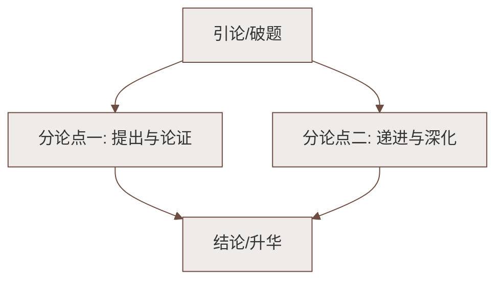

# 望岳

标签：#中考必考 #古诗 #背诵默写 #杜甫

## 一、原诗

> 岱宗夫如何？齐鲁青未了。
> 造化钟神秀，阴阳割昏晓。
> 荡胸生曾云，决眦入归鸟。
> 会当凌绝顶，一览众山小。

## 二、文学常识

| 项目 | 内容 |
|---|---|
| 作者 | 杜甫（712—770），字子美，自号少陵野老，唐代伟大的现实主义诗人，"诗圣"，其诗称"诗史" |
| 背景 | 作于开元二十四年前后，杜甫二十四五岁漫游齐赵时，是现存杜诗中最早的名篇之一 |
| 岳 | 指东岳泰山（岱宗），在今山东泰安 |
| 体裁 | 五言古诗（注意：不是律诗，不讲究严格对仗平仄） |

## 三、逐联赏析

**"岱宗夫如何？齐鲁青未了。"**（远望）
- 设问开篇，"夫如何"写乍见泰山的惊叹；
- "青未了"：苍翠山色绵延齐鲁大地看不到尽头——以广衬高，气象阔大。

**"造化钟神秀，阴阳割昏晓。"**（近望）
- "**钟**"：聚集，拟人——大自然把神奇秀丽都偏爱地给了泰山；
- "**割**"：山南山北判若晨昏，一字见泰山遮天蔽日之高峻（炼字典范）。

**"荡胸生曾云，决眦入归鸟。"**（细望）
- 云气层生使心胸激荡，睁裂眼眶目送归鸟；
- "曾"同"层"（通假）；"决眦"极言凝望之专注，侧面写山之壮美迷人。

**"会当凌绝顶，一览众山小。"**（愿望）
- "会当"：终当、终要；化用孔子"登泰山而小天下"；
- 由望岳而生登岳之志——**不怕困难、敢攀绝顶、俯视一切的雄心气概**（哲理：站得高才能看得远）。

## 四、重点字词

| 字词 | 读音/释义 |
|---|---|
| 岱宗 | dài，泰山尊称 |
| 未了 | liǎo，不尽 |
| 造化 | 大自然 |
| 钟 | 聚集 |
| 阴阳 | 山北为阴，山南为阳 |
| 曾云 | céng，"曾"同"层" |
| 决眦 | zì，眼眶几乎睁裂 |
| 会当 | 终当，终要 |
| 凌 | 登上 |

## 五、主题思想

全诗紧扣"望"字，由远及近、由朝至暮描绘泰山**神奇秀丽、巍峨高大**的形象，
抒发了青年杜甫**蓬勃的朝气和攀登人生顶峰的豪情壮志**。

## 六、练习题

1. 赏析"造化钟神秀，阴阳割昏晓"中的"钟"和"割"。
   > "钟"字拟人，写大自然对泰山情有独钟；"割"字夸张，写泰山之高将光线分割成昏晓两界，突出遮天蔽日的雄姿。
2. "会当凌绝顶，一览众山小"蕴含什么哲理？
   > 只有不畏艰险勇攀高峰，才能俯视一切、成就非凡；站得高方能看得远。
3. 默写高频：会当凌绝顶，一览众山小。／造化钟神秀，阴阳割昏晓。

## 七、知识联系

- 同单元"登高言志"组诗：与[[登幽州台歌]]（悲慨）、[[登飞来峰]]（政治自信）、[[游山西村]]（困境哲理）比较阅读；
- 青年壮志与[[己亥杂诗其五／写作：语言要简明／整本书阅读：《钢铁是怎样炼成的》]]中龚自珍的奉献精神可相互映照；
- 炼字题答题方法（释义→手法→效果→情感）适用于所有古诗赏析。

### 语文阅读与写作结构

