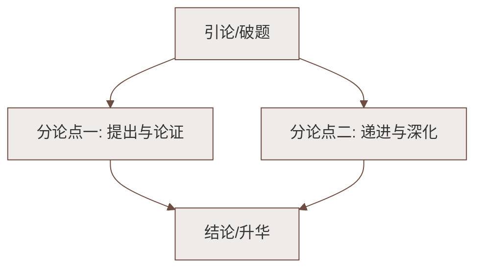

# 23 "蛟龙"探海（许晨）

标签：#中考高频 #报告文学 #科学探索 #深潜精神

## 一、文学常识

| 项目 | 内容 |
|---|---|
| 作者 | 许晨（1955— ），当代作家，山东德州人，报告文学《第四极——中国"蛟龙"号挑战深海》获鲁迅文学奖 |
| 题材 | "蛟龙"号载人潜水器 7000 米级海试 |
| 背景 | 2012 年 6 月，"蛟龙"号在马里亚纳海沟成功下潜至 7062 米，创造中国载人深潜纪录 |
| 体裁 | 报告文学（节选） |

## 二、课文要点

1. **出征深海**：向阳红 09 船搭载"蛟龙"号驶向马里亚纳海沟——地球已知最深处（"第四极"）；
2. **下潜过程**（紧张有序）：
   - 潜航员进舱、注水下潜，深度数字不断刷新；
   - 深海世界的奇异：黑暗、高压（每平方厘米承受约 700 公斤压力）、未知生物；
3. **突破 7000 米**：舱内潜航员沉着操作，与母船保持通话；"7062 米"——中国深度诞生的时刻；
4. **意义与精神**：
   - 标志我国具备在全球 99% 以上海域开展作业的能力；
   - 太空有"神舟"，深海有"蛟龙"——**"上九天揽月，下五洋捉鳖"**变为现实；
   - 凝聚着科研人员自力更生、协同攻坚的心血。

## 三、重点字词

| 字词 | 读音 | 释义 |
|---|---|---|
| 潜水器 | qián | 水下作业的装备 |
| 海沟 | gōu | 深海底部狭长的洼地 |
| 浩瀚 | hàn | 广大，繁多 |
| 惊涛骇浪 | hài | 凶猛吓人的浪涛 |
| 攻坚克难 | jiān | 攻克重点难关 |
| 沉着冷静 | chén zhuó | 镇静，不慌张 |
| 载人 | zài | 装载人员（多音字：记载 zǎi） |
| 刷新纪录 | — | 突破原有纪录（"纪录"不写作"记录"） |

## 四、写法分析

1. **纪实性与文学性结合**：数据准确（7062 米、水压数值）＋场面描写生动（下潜时的紧张、突破时的欢腾）；
2. **点面结合**：既写潜航员舱内操作的"点"，又写母船指挥、全国关注的"面"；
3. **烘托渲染**：以深海的黑暗高压之险衬托深潜勇士的无畏与技术的可靠；
4. **对比联想**：由"蛟龙"探海联想到航天壮举，凸显民族科技崛起的整体图景。

## 五、主题思想

课文记述"蛟龙"号成功下潜 7062 米的历史时刻，
展现了我国深海科技的重大突破，讴歌了科研人员与潜航员
**严谨务实、勇攀高峰、无私奉献、团结协作**的"中国深度"精神。

## 六、练习题

1. 题目"'蛟龙'探海"好在哪里？
   > "蛟龙"既是潜水器之名，又化用神话意象（蛟龙入海），生动形象；"探"字突出科学探索的主动精神。
2. 文中大量精确数据有什么作用？
   > 体现报告文学的真实性、科学性，直观展示深潜难度与成就的分量。
3. "蛟龙"精神与航天精神有何相通之处？
   > 都体现自主创新、不畏艰险、团结协作、追求卓越的科学报国精神。

## 七、知识联系

- 与[[22 太空一日]]"上天入海"对读，同属"科学探索"活动·探究单元；
- 科幻之思见[[24 带上她的眼睛]]：真实探测与幻想文学互补；
- 中国古代的科技智慧参见[[25 活板]]，古今呼应。

### 语文阅读与写作结构

