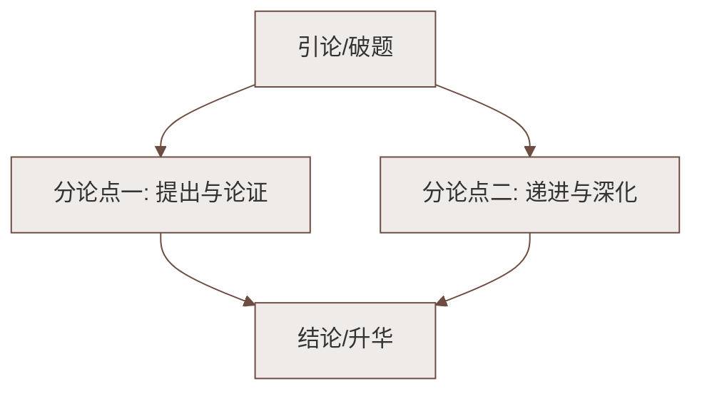

# 25 活板

标签：#中考必考 #文言文 #说明性古文 #四大发明

## 一、文学常识

| 项目 | 内容 |
|---|---|
| 作者 | 沈括（1031—1095），字存中，北宋科学家、政治家 |
| 出处 | 《梦溪笔谈》——被英国学者李约瑟誉为"中国科学史上的里程碑" |
| 内容 | 记载毕昇发明的活字印刷术（四大发明之一） |
| 体裁 | 文言说明文 |

## 二、课文思路

1. **简述沿革**："板印书籍，唐人尚未盛为之"——雕版印刷的历史；五代始印五经；
2. **点出发明**："庆历中，有布衣毕昇，又为活板"——时间、人物（平民身份）、事件；
3. **详细说明活板工艺**（按工作程序）：
   - **制字**：胶泥刻字，薄如钱唇，每字一印，火烧令坚；
   - **设版**：铁板上敷松脂、蜡和纸灰；
   - **排字**：铁范置铁板，密布字印；
   - **炀版**：火烤药熔，平板按压，"字平如砥"；
   - **印刷**：两板交替，"更互用之，瞬息可就"；
4. **说明高效关键**："**活**"——每字皆有数印；奇字旋刻；不用则贴纸标记收藏；
5. **交代下落**：毕昇死后，字印为沈括堂兄弟侄辈所得，"至今保藏"。

## 三、重点字词（文言积累）

| 词句 | 释义 |
|---|---|
| 板印书籍 | 用雕版（名词作状语） |
| 唐人尚未**盛**为之 | 大规模地 |
| 已后典籍皆为板本 | "已"同"以"（通假） |
| 有**布衣**毕昇 | 平民 |
| 薄如**钱唇** | 铜钱的边缘 |
| **火**烧令坚 | 用火（名词作状语） |
| 持**就**火炀之 | 靠近；炀 yáng：烘烤 |
| 字平如**砥** | dǐ，磨刀石 |
| **更互**用之 | 交替，轮流 |
| **瞬息**可就 | 极短时间；完成 |
| 每字皆有数印 | 几个字模 |
| 奇字**素**无备者 | 平时 |
| **旋**刻之 | 随即，立刻 |
| 用讫再火令药**熔** | 讫 qì：完毕 |
| 其印为予群从所得 | 被（"为……所"被动句） |

## 四、说明方法与写法

1. **抓住特征**：全文紧扣一个"**活**"字——字是活的（每字一印）、排版是活的（密布铁范）、印刷是活的（两板更互）、字印数目是活的（一字数印）、做法是活的（奇字旋刻）、收藏是活的（贴纸标记）；
2. **程序顺序**（逻辑顺序）：制字→排版→印刷，条理分明；
3. **作比较**："若止印三二本，未为简易；若印数十百千本，则极为神速"——突出活板高效的适用条件；
4. **打比方**："薄如钱唇""字平如砥""如燔土"，化抽象为具体；
5. 语言准确简洁：用词精当，如"燔、炀、贮、帖"各有分工。

## 五、重点句翻译

1. 有奇字素无备者，旋刻之，以草火烧，瞬息可成。
   > 遇到平时没有准备的生僻字，随即刻制，用草火烧成，很快就能完成。
2. 不以木为之者，文理有疏密，沾水则高下不平。
   > 不用木头刻字模的原因，是木头纹理有疏有密，沾水后就高低不平。

## 六、主题思想

本文抓住"活"的特征，按工作程序有条理地说明活字印刷的**制作、排版、印刷**全过程，
体现毕昇的创造精神和我国古代劳动人民**卓越的智慧**，也展示了沈括严谨求实的科学记录态度。

## 七、练习题

1. 活板的"活"体现在哪些方面？（结合原文）
   > 字活、排版活、印刷活（更互用之）、字印数活、奇字旋刻、拆版收藏活。
2. 为什么用胶泥而不用木料刻字？
   > 木纹疏密不匀，沾水高低不平，又与药相粘不易取下；胶泥烧硬耐用，"殊不沾污"。
3. 文中"为"字多义辨析：唐人尚未盛为之（做）；皆为板本（是）；又为活板（发明、制作）；其印为予群从所得（被）。

## 八、知识联系

- 与[[22 太空一日]][[23 "蛟龙"探海（许晨）]]同单元：古代发明与现代科技的探索精神一脉相承；
- 文言实词、通假字与[[4 孙权劝学]][[13 卖油翁]][[17 短文两篇（陋室铭；爱莲说）]]滚动复习；
- 按程序说明事物的方法可迁移到说明文写作。

### 语文阅读与写作结构

