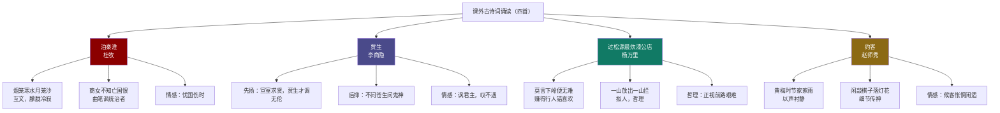

# 课外古诗词诵读：泊秦淮／贾生／过松源晨炊漆公店（其五）／约客

标签：#中考必考 #古诗词 #背诵默写

## 一、《泊秦淮》——杜牧

> 烟笼寒水月笼沙，夜泊秦淮近酒家。
> 商女不知亡国恨，隔江犹唱后庭花。

- **作者**：杜牧（803—852），字牧之，晚唐诗人，与李商隐并称"**小李杜**"；
- **背景**：秦淮河畔是金陵繁华之地；《玉树后庭花》为陈后主所作，被视为**亡国之音**；
- **赏析**：
  - 首句两个"笼"字：烟、月、水、沙交织，朦胧冷寂的水色夜景，奠定伤感基调（互文）；
  - "商女不知亡国恨"：**曲笔**——表面责歌女，实则**讽刺醉生梦死的晚唐统治者**；
  - "犹"字：微妙深沉，历史教训犹在而人不知警醒；
- **情感**：忧国伤时，对统治者荒淫误国的忧愤；
- **默写高频**：商女不知亡国恨，隔江犹唱后庭花。

## 二、《贾生》——李商隐

> 宣室求贤访逐臣，贾生才调更无伦。
> 可怜夜半虚前席，不问苍生问鬼神。

- **作者**：李商隐（约 813—858），字义山，号玉谿生，晚唐诗人；
- **典故**：汉文帝宣室召见贾谊，问的却是鬼神之事（《史记》）；
- **赏析**：
  - 先扬后抑：前两句极写文帝求贤若渴、贾生才华无双；
  - "**可怜**"陡转："虚前席"——凑近倾听却问非所问；
  - "不问苍生问鬼神"：**讽刺统治者不能真正重贤爱民**，也寄寓诗人怀才不遇之慨；
- **默写高频**：可怜夜半虚前席，不问苍生问鬼神。

## 三、《过松源晨炊漆公店（其五）》——杨万里

> 莫言下岭便无难，赚得行人错喜欢。
> 政入万山围子里，一山放出一山拦。

- **作者**：杨万里（1127—1206），号诚斋，南宋诗人，"诚斋体"活泼自然，与陆游、尤袤、范成大并称"中兴四大诗人"；
- **赏析**：
  - "赚"字幽默："骗"得行人空欢喜；
  - "放出""拦"：**拟人**，群山如顽童设障；
  - **哲理**：人生道路上困难一个接一个，**不要被一时的顺境（下岭）迷惑，要对前路的艰难有充分估计**；
- **默写高频**：政入万山围子里，一山放出一山拦。

## 四、《约客》——赵师秀

> 黄梅时节家家雨，青草池塘处处蛙。
> 有约不来过夜半，闲敲棋子落灯花。

- **作者**：赵师秀（1170—1219），号灵秀，南宋"**永嘉四灵**"之一；
- **赏析**：
  - 前两句：江南梅雨时节的夏夜，雨声、蛙声——**以声衬静**，渲染幽静清寂；
  - "**闲敲棋子**"：细节传神——候客不至，下意识敲棋，**含而不露地写出怅惘、无聊而又闲适的复杂心境**；"落灯花"暗示夜深坐久；
- **默写高频**：有约不来过夜半，闲敲棋子落灯花。

## 五、四首对比总表

| 诗题 | 作者 | 题材 | 核心情感/哲理 | 主要手法 |
|---|---|---|---|---|
| 泊秦淮 | 杜牧 | 咏史讽今 | 忧国忧时 | 曲笔、用典、互文 |
| 贾生 | 李商隐 | 咏史 | 讽君主、叹不遇 | 先扬后抑、用典 |
| 过松源晨炊漆公店 | 杨万里 | 哲理 | 正视前路艰难 | 拟人、理趣 |
| 约客 | 赵师秀 | 生活小景 | 候客怅惘闲适 | 以声衬静、细节 |

## 六、练习题

1. 《泊秦淮》真正批评的对象是谁？
   > 不是商女，而是不顾国势衰微、依旧寻欢作乐的晚唐统治者（曲笔讽刺）。
2. 《贾生》"先扬后抑"体现在哪里？
   > 前两句盛赞求贤与才华，后两句陡转——问的竟是鬼神而非苍生，讽意顿出。
3. "一山放出一山拦"给你什么人生启示？
   > 困难接踵而至是常态，须有长期奋斗的思想准备，不可因一时顺利而懈怠。

## 结构图解

## 七、知识联系

- 与[[课外古诗词诵读：竹里馆／春夜洛城闻笛／逢入京使／晚春]]合为本册八首必背课外古诗；
- 咏史讽今的怀才之叹可联系[[登幽州台歌]]；
- 杨万里的理趣诗与[[游山西村]]"山重水复"句对读：一言"又一村"的希望，一言"一山拦"的清醒。
