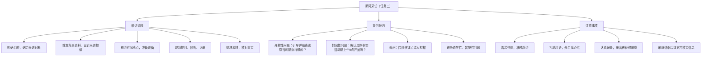

# 任务二 新闻采访

标签：#新闻 #活动探究 #实践

## 一、采访常识

新闻采访是记者为获取新闻事实而进行的调查研究活动，是新闻写作的基础。基本要求：**准备充分、提问具体、倾听记录、尊重对象**。

## 二、采访流程

1. 明确采访目的，确定采访对象；
2. 搜集背景资料，设计采访提纲；
3. 预约时间地点，准备设备；
4. 现场提问、倾听、记录；
5. 整理采访素材，核对事实。

## 三、提问技巧

- **开放性问题**：引导被访者详细表达，如“您当时是怎样想的？”
- **封闭性问题**：确认具体事实，如“活动是上午 9 点开始吗？”
- **追问**：围绕关键点深入挖掘；
- 避免诱导性、冒犯性问题。

## 四、采访提纲示例

采访校园运动会志愿者：

1. 您负责哪些工作？每天服务多长时间？
2. 服务中遇到印象最深的事是什么？
3. 您认为志愿者工作最大的意义是什么？

## 五、注意事项

1. 着装得体，准时赴约；
2. 用语礼貌，先自我介绍；
3. 认真记录，可录音（需征得同意）；
4. 采访结束后致谢并核实关键信息。

## 六、实践任务

1. 围绕“校园里的劳动者”设计一份采访提纲；
2. 采访一位同学或老师，整理 500 字采访记录；
3. 小组交流：谁的提问最能挖掘细节？

## 结构图解

## 七、知识联系

- 采访成果为[[任务三 新闻写作]]提供素材；
- 采访能力也能用于[[单元综合实践]]中的展示与交流。

## 八、复习建议

1. 模拟一次校园采访，完成采访提纲与记录；
2. 对照[[任务一 新闻阅读]]，理解采访对写作的支撑作用；
3. 为[[任务三 新闻写作]]积累真实素材。
