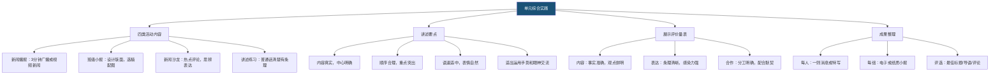

# 单元综合实践

标签：#新闻 #活动探究 #口语交际

## 一、实践目标

整合新闻阅读、采访与写作成果，通过“讲述”“播报”“编报”等活动，提升信息筛选、口头表达与团队协作能力。

## 二、活动内容建议

1. **新闻播报**：小组合作，将本单元作品制作成 3 分钟广播或视频新闻；
2. **班级小报**：设计版面，选稿、配图、拟标题；
3. **新闻沙龙**：围绕热点事件展开评论，训练思辨表达；
4. **“讲述”练习**：用普通话清楚、有条理地讲述一件事。

## 三、“讲述”要点

- 内容真实，中心明确；
- 顺序合理，重点突出；
- 语速适中，表情自然；
- 适当运用手势和眼神交流。

## 四、展示评价量表

| 维度 | 优秀 | 合格 |
|---|---|---|
| 内容 | 事实准确，观点鲜明 | 基本完整，无重大错误 |
| 表达 | 条理清晰，感染力强 | 语句通顺，能说明白 |
| 合作 | 分工明确，配合默契 | 有分工，能完成基本任务 |

## 五、成果整理

1. 每人提交一则消息或特写；
2. 每组制作一份电子或纸质小报；
3. 评选“最佳标题”“最佳导语”“最佳评论”。

## 六、反思提升

- 我的新闻最吸引人的地方是什么？
- 还有哪些事实可以采访得更充分？
- 如何让语言更简洁准确？

## 结构图解

## 七、知识联系

- 实践成果来自[[任务一 新闻阅读]][[任务二 新闻采访]][[任务三 新闻写作]]；
- 讲述能力为后续[[写作：表达要得体]]打基础。

## 八、复习建议

1. 整理本单元三类成果：阅读笔记、采访记录、新闻稿件；
2. 小组合作制作班级新闻小报；
3. 通过[[任务三 新闻写作]]深化[[任务一 新闻阅读]]的理解。
