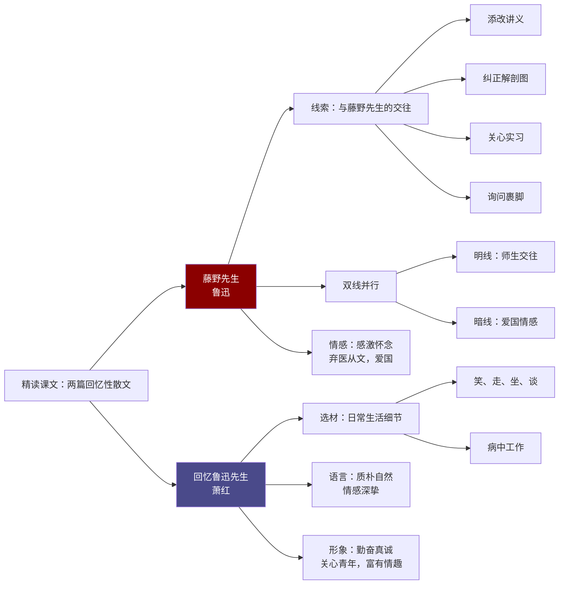

# 精读课文：藤野先生与回忆鲁迅先生

标签：#回忆性散文 #鲁迅 #人物描写

## 一、文学常识

| 篇目 | 作者 | 出处/身份 |
|---|---|---|
| 《藤野先生》 | 鲁迅（1881—1936），原名周树人 | 散文集《朝花夕拾》 |
| 《回忆鲁迅先生》 | 萧红（1911—1942），黑龙江呼兰人 | 现代女作家，代表作《呼兰河传》 |

## 二、《藤野先生》要点

1. **线索**：作者与藤野先生的交往（添改讲义、纠正解剖图、关心实习、询问裹脚）。
2. **情感**：感激、怀念藤野先生；因“匿名信”“看电影”事件而弃医从文，表达强烈爱国情。
3. **写法**：选取典型事例，以小见大；双线并行（明线交往，暗线爱国）。

## 三、《回忆鲁迅先生》要点

1. **选材**：日常生活细节（笑、走、坐、谈、病中工作），展现鲁迅平凡而伟大的一面。
2. **语言**：质朴自然，情感深挚。
3. **形象**：勤奋、真诚、关心青年、富有生活情趣。

## 四、重点字词

| 字词 | 读音 | 释义 |
|---|---|---|
| 绯红 | fēi hóng | 鲜红 |
| 宛如 | wǎn rú | 好像 |
| 抑扬顿挫 | yì yáng dùn cuò | 声音高低起伏 |
| 深恶痛疾 | wù | 厌恶痛恨 |
| 阖眼 | hé yǎn | 闭眼 |
| 揩油 | kāi yóu | 比喻占便宜 |

## 五、段落赏析

《藤野先生》中“他的性格，在我的眼里和心里是伟大的”一句，直接抒情，点明主旨。

《回忆鲁迅先生》中“鲁迅先生走路的姿态”等细节，以小见大，凸显人物精神。

## 六、主题思想

两文均通过回忆表达对杰出人物的敬仰与怀念，体现真挚情感与人格力量。

## 七、练习题

1. 藤野先生为什么让鲁迅“时时记起”？
2. 萧红笔下的鲁迅与你想象中的鲁迅有何不同？
3. 比较两文在选材与抒情方式上的异同。

## 结构图解

## 八、知识联系

- 两文同属第二单元，可与[[自读课文：天上有颗“南仁东星”与美丽的颜色]]对比阅读；
- 人物素材可直接用于[[写作：学写传记]]。
