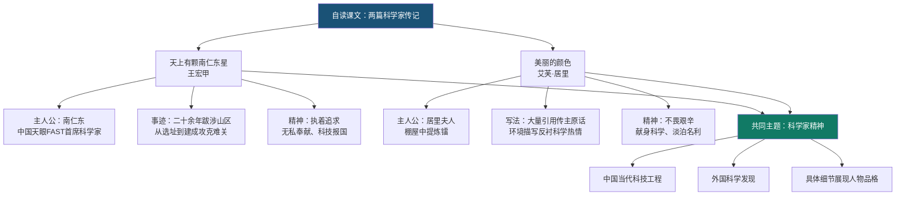

# 自读课文：天上有颗“南仁东星”与美丽的颜色

标签：#人物传记 #科学精神 #自读

## 一、文学常识

| 篇目 | 作者 | 体裁 |
|---|---|---|
| 《天上有颗"南仁东星"》 | 王宏甲 | 报告文学/人物通讯 |
| 《美丽的颜色》 | 艾芙·居里 | 传记（节选） |

## 二、《天上有颗“南仁东星”》要点

1. **主人公**：南仁东，“中国天眼”（FAST）工程首席科学家。
2. **事迹**：从选址到建成，二十余年跋涉山区，攻克重重难关。
3. **精神**：执着追求、无私奉献、勇于创新、科技报国。

## 三、《美丽的颜色》要点

1. **主人公**：居里夫人在棚屋中提炼镭的艰苦过程。
2. **写法**：大量引用传主原话，增强真实感；环境描写反衬科学热情。
3. **精神**：不畏艰辛、献身科学、淡泊名利。

## 四、自读策略

1. 借助旁批与阅读提示，把握人物精神；
2. 圈画关键数据、时间、场景；
3. 比较两文表现科学家的不同角度。

## 五、重点字词

| 字词 | 读音 | 释义 |
|---|---|---|
| 凛冽 | lǐn liè | 极为寒冷 |
| 轮廓 | lún kuò | 物体外缘线条 |
| 崎岖 | qí qū | 山路不平 |
| 炽热 | chì rè | 温度极高，热情极盛 |
| 沥青 | lì qīng | 铺路材料 |
| 轮廓 | lún kuò | 外形 |

## 六、主题比较

两文都写科学家，但一写中国当代科技工程，一写外国科学发现；都用具体细节展现人物品格。

## 七、练习题

1. 南仁东为 FAST 付出了哪些艰辛？请举例说明。
2. 《美丽的颜色》中环境描写有何作用？
3. 选择一位科学家，列出为他写小传可用的事实。

## 结构图解

## 八、知识联系

- 与[[精读课文：藤野先生与回忆鲁迅先生]]组成第二单元人物群像；
- 为[[写作：学写传记]]提供范文。
