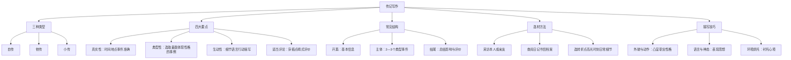

# 写作：学写传记

标签：#写作 #传记 #人物

## 一、传记特点

传记是记述人物生平事迹的文章，要求真实、典型、生动。可分为自传、他传、小传。

## 二、写作要点

1. **真实性**：时间、地点、事件必须准确，有据可查。
2. **典型性**：选取最能体现人物性格与精神的事例。
3. **生动性**：通过细节、语言、行动描写让人物“立”起来。
4. **适当评论**：在叙述中穿插点睛式评价。

## 三、常见结构

1. **开篇**：介绍人物基本信息（姓名、生卒、身份）；
2. **主体**：按时间顺序或逻辑顺序选取 2—3 个典型事件；
3. **结尾**：总结人物影响，表达评价或情感。

## 四、选材方法

- 采访本人或亲友，获取第一手资料；
- 查阅日记、书信、照片、档案；
- 选择“转折点”“高光时刻”“日常细节”。

## 五、描写技巧

1. 外貌与动作：凸显职业或性格；
2. 语言与神态：表现人物思想；
3. 环境烘托：用场景衬托人物心境。

## 六、升格提示

- 避免流水账式罗列；
- 不夸大、不编造；
- 用具体数据、对话增强可信度。

## 七、练习任务

1. 为家人写一篇 600 字小传；
2. 采访一位老师，整理成 800 字人物通讯；
3. 修改同学作文，使人物形象更鲜明。

## 结构图解

## 八、知识联系

- 可借鉴[[精读课文：藤野先生与回忆鲁迅先生]]的写人方法；
- [[自读课文：天上有颗“南仁东星”与美丽的颜色]]是传记与通讯的范例。

## 九、复习建议

1. 回顾[[精读课文：藤野先生与回忆鲁迅先生]]的写人技巧；
2. 为家人或老师列一份传记素材清单；
3. 与[[自读课文：天上有颗“南仁东星”与美丽的颜色]]对比选材角度。
