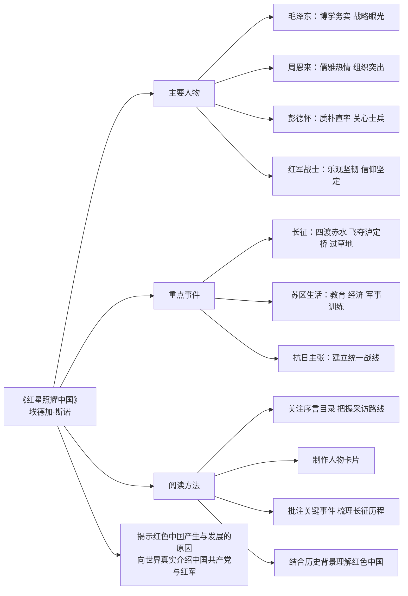

# 整本书阅读：《红星照耀中国》

标签：#名著 #纪实文学 #革命

## 一、作品常识

| 项目 | 内容 |
|---|---|
| 原名 | Red Star Over China |
| 作者 | 埃德加·斯诺，美国记者 |
| 体裁 | 纪实文学/报告文学 |
| 内容 | 1936 年作者深入陕甘宁边区采访中国共产党与红军 |

## 二、阅读价值

1. 真实记录长征与延安生活；
2. 展现毛泽东、周恩来、彭德怀等领袖形象；
3. 是了解中国革命历史的窗口。

## 三、阅读方法

1. 关注序言与目录，把握采访路线；
2. 制作人物卡片，记录主要人物事迹；
3. 批注关键事件，梳理长征历程；
4. 结合历史背景理解“红色中国”。

## 四、主要人物

- **毛泽东**：博学、务实、具有战略眼光；
- **周恩来**：儒雅、热情、组织能力突出；
- **彭德怀**：质朴、直率、关心士兵；
- **红军战士**：乐观、坚韧、信仰坚定。

## 五、重点事件

1. 长征：四渡赤水、飞夺泸定桥、过草地；
2. 苏区生活：教育、经济、军事训练；
3. 抗日主张：建立统一战线。

## 六、主题思想

作品向世界真实介绍了中国共产党与红军，揭示“红色中国”产生与发展的原因。

## 七、练习题

1. 斯诺为什么能进入陕北采访？
2. 选择一位领袖，分析作者如何刻画其形象。
3. 本书为何被视为“用事实说话”的典范？

## 结构图解

## 八、知识联系

- 与第二单元人物类文章[[精读课文：藤野先生与回忆鲁迅先生]]等互补；
- 纪实手法可与[[任务一 新闻阅读]]的消息、通讯对照。
