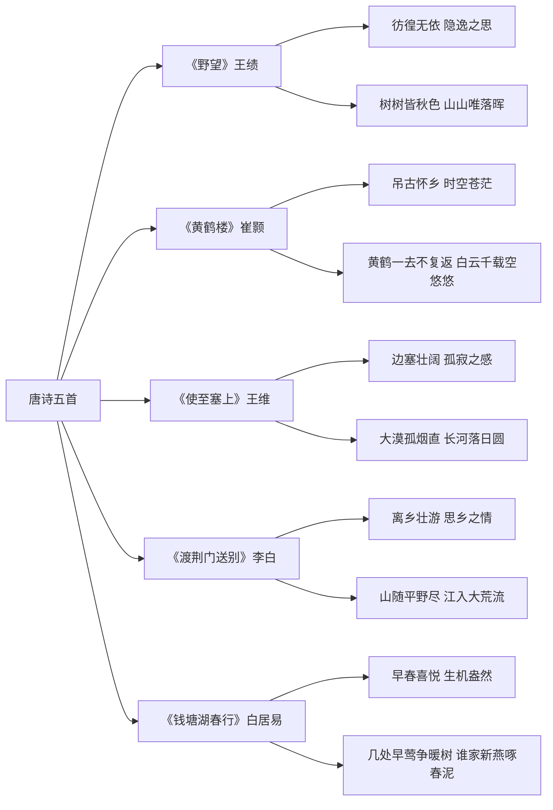

# 唐诗五首

标签：#古诗 #唐诗 #背诵

## 一、诗歌概览

| 诗题 | 作者 | 朝代 | 核心情感 |
|---|---|---|---|
| 《野望》 | 王绩 | 唐 | 彷徨无依、隐逸之思 |
| 《黄鹤楼》 | 崔颢 | 唐 | 吊古怀乡 |
| 《使至塞上》 | 王维 | 唐 | 边塞壮阔、孤寂 |
| 《渡荆门送别》 | 李白 | 唐 | 离乡壮游、思乡 |
| 《钱塘湖春行》 | 白居易 | 唐 | 早春喜悦 |

## 二、名句赏析

1. “树树皆秋色，山山唯落晖”：层层渲染秋景，烘托孤独。
2. “黄鹤一去不复返，白云千载空悠悠”：时空苍茫，感慨深沉。
3. “大漠孤烟直，长河落日圆”：线条简洁，画面雄浑，王国维称“千古壮观”。
4. “山随平野尽，江入大荒流”：空间转换，气势开阔。
5. “几处早莺争暖树，谁家新燕啄春泥”：生机勃勃，早春典型意象。

## 三、重点字词

| 字词 | 读音 | 释义 |
|---|---|---|
| 徙倚 | xǐ yǐ | 徘徊 |
| 萋萋 | qī qī | 草木茂盛 |
| 征蓬 | péng | 飘飞的蓬草 |
| 归雁 | yàn | 北归大雁 |
| 怜 | lián | 喜爱 |
| 没 | mò | 遮没 |

## 四、艺术特色

1. **情景交融**：借景抒情，景语皆情语；
2. **炼字传神**：如“直”“圆”“争”“啄”；
3. **音韵和谐**：律诗讲究对仗、平仄。

## 五、背诵提示

按“秋暮—古楼—大漠—长江—西湖”画面联背，抓住每首诗的“诗眼”。

## 六、练习题

1. 任选一首，分析诗人如何通过景物表达情感。
2. “大漠孤烟直，长河落日圆”为何被誉为写景名句？
3. 比较《野望》与《钱塘湖春行》情感基调。

## 结构图解

## 七、知识联系

- 山水意象承接[[古诗文精读：三峡、短文二篇、与朱元思书]]；
- 写景技巧可用于[[写作：学习描写景物]]。
