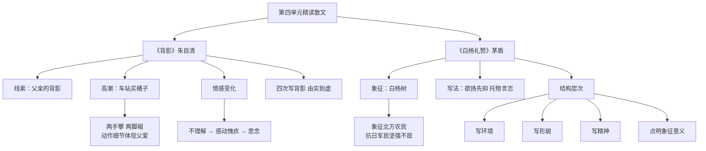

# 精读课文：背影与白杨礼赞

标签：#散文 #亲情 #象征

## 一、文学常识

| 篇目 | 作者 | 体裁/风格 |
|---|---|---|
| 《背影》 | 朱自清（1898—1948） | 叙事散文，朴素真挚 |
| 《白杨礼赞》 | 茅盾（1896—1981） | 抒情散文，托物言志 |

## 二、《背影》要点

1. **线索**：父亲的背影。
2. **高潮**：车站买橘子，“他用两手攀着上面，两脚再向上缩”——动作细节体现父爱。
3. **情感**：从不理解到感动愧疚，再到思念。

## 三、《白杨礼赞》要点

1. **象征**：白杨树象征北方农民、抗日军民的坚强不屈。
2. **写法**：欲扬先抑，层层蓄势；由树及人，托物言志。
3. **结构**：写环境—写形貌—写精神—点明象征意义。

## 四、重点字词

| 字词 | 读音 | 释义 |
|---|---|---|
| 蹒跚 | pán shān | 走路不稳 |
| 颓唐 | tuí táng | 衰颓失意 |
| 簌簌 | sù sù | 纷纷落下 |
| 主宰 | zǎi | 支配 |
| 倦怠 | dài | 疲乏困倦 |
| 恹恹欲睡 | yān | 精神萎靡 |

## 五、段落赏析

《背影》四次写背影，由实到虚，情感渐深。

《白杨礼赞》中“它没有婆娑的姿态……”一段，排比反问，增强气势。

## 六、主题比较

两文皆为经典散文，一以亲情动人，一以象征寓意；都体现了作者深厚的情感与民族情怀。

## 七、练习题

1. 分析父亲买橘子时的动作描写。
2. 白杨树的象征意义是如何逐步揭示的？
3. 比较两篇散文抒情方式的异同。

## 结构图解

## 八、知识联系

- 与[[自读课文：散文二篇与昆明的雨]]同属第四单元散文；
- 景物与情感结合可为[[写作：语言要连贯]]提供借鉴。
