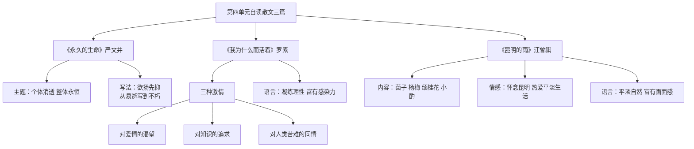

# 自读课文：散文二篇与昆明的雨

标签：#散文 #自读 #生命

## 一、文学常识

| 篇目 | 作者 | 体裁 |
|---|---|---|
| 《永久的生命》 | 严文井 | 哲理散文 |
| 《我为什么而活着》 | 罗素（英） | 哲理散文 |
| 《昆明的雨》 | 汪曾祺 | 回忆性散文 |

## 二、《永久的生命》要点

1. **主题**：生命是永久的，个体消逝而整体永恒。
2. **写法**：欲扬先抑，从“易逝”写到“不朽”。

## 三、《我为什么而活着》要点

1. **三种激情**：对爱情的渴望、对知识的追求、对人类苦难不可遏制的同情。
2. **语言**：凝练、理性、富有感染力。

## 四、《昆明的雨》要点

1. **内容**：雨季中的菌子、杨梅、缅桂花及与友人的小酌。
2. **情感**：对昆明生活的怀念，对平淡生活的热爱。
3. **语言**：平淡自然，富有画面感和生活情趣。

## 五、自读策略

1. 抓住文眼：“永久的生命”“我为什么而活着”“我想念昆明的雨”；
2. 体会哲理散文的思辨与抒情散文的韵味；
3. 比较三文在选材与语言上的差异。

## 六、重点字词

| 字词 | 读音 | 释义 |
|---|---|---|
| 卑微 | bēi wēi | 地位低下 |
| 遏制 | è zhì | 阻止 |
| 濒临 | bīn lín | 接近 |
| 菌子 | jùn zi | 蘑菇等真菌 |
| 密匝匝 | zā | 浓密 |
| 张目结舌 | jié | 瞪眼说不出话 |

## 七、练习题

1. 你认同罗素“三种激情”的人生追求吗？为什么？
2. 汪曾祺如何通过寻常事物表现深情？
3. 摘抄并赏析一段你喜欢的文字。

## 结构图解

## 八、知识联系

- 与[[精读课文：背影与白杨礼赞]]共同构成第四单元散文阅读；
- 哲理思考可服务于[[写作：语言要连贯]]中的观点表达。
