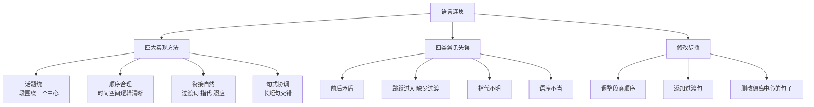

# 写作：语言要连贯

标签：#写作 #表达 #连贯

## 一、连贯要求

语言连贯指句子之间衔接自然、语义贯通、条理清楚。写作中要注意话题统一、顺序合理、衔接自然。

## 二、实现方法

1. **话题统一**：一段围绕一个中心，避免中途转换主语；
2. **顺序合理**：时间、空间、逻辑顺序清晰；
3. **衔接自然**：使用过渡词、过渡句、指代、照应；
4. **句式协调**：长短句交错，避免结构混乱。

## 三、常见失误

- 前后矛盾；
- 跳跃过大，缺少过渡；
- 指代不明；
- 语序不当。

## 四、修改示例

原句：“我喜欢读书。书籍能开阔眼界。老师鼓励我们多读书。”

修改：“我喜欢读书，因为书籍能开阔眼界；老师也常鼓励我们多读书。”

## 五、升格训练

1. 调整下面段落顺序，使说明更连贯；
2. 为一段文字添加恰当的过渡句；
3. 删改重复或偏离中心的句子。

## 六、练习任务

1. 以“我的校园”为题写一段连贯的文字；
2. 修改[[写作：学习描写景物]]习作，增强句间衔接；
3. 写一段 300 字说明性文字，注意逻辑顺序。

## 结构图解

## 七、知识联系

- 阅读[[自读课文：散文二篇与昆明的雨]]可体会散文的自如过渡；
- 与[[写作：说明事物要抓住特征]]共同训练说明与议论的条理性。

## 八、复习建议

1. 任选一篇课文，画出过渡词与过渡句；
2. 修改一篇旧作，专门解决衔接问题；
3. 与[[写作：说明事物要抓住特征]]共同训练逻辑表达。
