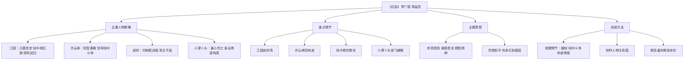

# 整本书阅读：《红岩》

标签：#名著 #革命文学 #红色经典

## 一、作品常识

| 项目 | 内容 |
|---|---|
| 作者 | 罗广斌、杨益言 |
| 体裁 | 长篇小说（革命历史题材） |
| 背景 | 1948—1949 年重庆解放前夕，渣滓洞、白公馆监狱 |
| 主题 | 革命者坚贞不屈、追求光明 |

## 二、主要内容

小说描写重庆地下党与国民党反动派的斗争，刻画江姐、许云峰、刘思扬、成岗、小萝卜头等英雄群像。

## 三、主要人物

- **江姐**：沉着坚定，狱中绣红旗，视死如归；
- **许云峰**：机智勇敢，领导狱中斗争；
- **成岗**：印刷《挺进报》，坚贞不屈；
- **小萝卜头**：年龄最小的烈士，象征希望与纯真。

## 四、阅读方法

1. 梳理情节：越狱、狱中斗争、秘密传递情报；
2. 关注人物：制作人物关系图；
3. 品味语言：体会革命浪漫主义的抒情；
4. 联系历史：了解重庆解放史实。

## 五、重点情节

1. 江姐赴刑场；
2. 许云峰挖地道；
3. 狱中新年联欢；
4. 小萝卜头放飞蝴蝶。

## 六、主题思想

表现共产党人的崇高信仰、钢铁意志和牺牲精神，激励读者珍惜和平、传承红色基因。

## 七、练习题

1. 选择一位人物，分析其精神成长。
2. “红岩”象征什么？结合小说谈谈。
3. 比较《红岩》与《红星照耀中国》在写法上的异同。

## 结构图解

## 八、知识联系

- 同属红色经典，可与[[整本书阅读：《红星照耀中国》]]对比；
- 人物精神可与[[精读课文：背影与白杨礼赞]]的家国情怀呼应。
