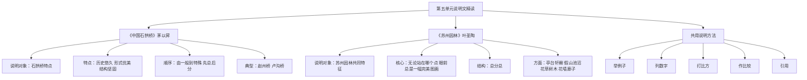

# 精读课文：中国石拱桥与苏州园林

标签：#说明文 #建筑 #传统文化

## 一、文学常识

| 篇目 | 作者 | 身份 |
|---|---|---|
| 《中国石拱桥》 | 茅以昇（1896—1989） | 桥梁专家、教育家 |
| 《苏州园林》 | 叶圣陶（1894—1988） | 作家、教育家 |

## 二、《中国石拱桥》要点

1. **说明对象**：中国石拱桥的特点：历史悠久、形式优美、结构坚固。
2. **说明顺序**：由一般到特殊，先总后分；以赵州桥、卢沟桥为典型。
3. **说明方法**：举例子、列数字、打比方、作比较、引用。

## 三、《苏州园林》要点

1. **说明对象**：苏州园林的共同特征——“务必使游览者无论站在哪个点上，眼前总是一幅完美的图画”。
2. **结构**：总分总，从亭台轩榭、假山池沼、花草树木、花墙廊子等方面说明。
3. **语言**：准确、简洁、典雅。

## 四、重点字词

| 字词 | 读音 | 释义 |
|---|---|---|
| 雄跨 | xióng kuà | 雄伟地跨越 |
| 残损 | cán sǔn | 破损 |
| 古朴 | pǔ | 朴素而有古风 |
| 镂空 | lòu kōng | 雕刻出穿透花纹 |
| 斟酌 | zhēn zhuó | 考虑事情是否可行 |
| 因地制宜 | yīn dì zhì yí | 根据当地情况制定办法 |

## 五、说明方法辨析

找出文中列数字、举例子、作比较、打比方的句子，体会其作用。

## 六、练习题

1. 赵州桥的设计有哪些巧妙之处？
2. 苏州园林如何体现“图画美”？
3. 比较两文在说明顺序上的异同。

## 结构图解

## 七、知识联系

- 与[[自读课文：人民英雄永垂不朽与梦回繁华]]同属说明文单元；
- 说明方法可用于[[写作：说明事物要抓住特征]]。

## 八、复习建议

1. 制作说明方法卡片，标注课文例句；
2. 画思维导图梳理两文结构；
3. 将说明技巧迁移到[[写作：说明事物要抓住特征]]。
