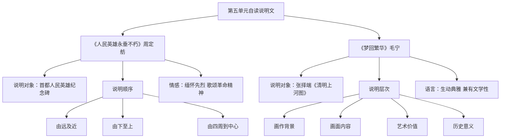

# 自读课文：人民英雄永垂不朽与梦回繁华

标签：#说明文 #革命 #传统文化

## 一、文学常识

| 篇目 | 作者 | 体裁 |
|---|---|---|
| 《人民英雄永垂不朽》 | 周定舫 | 说明文/瞻仰记 |
| 《梦回繁华》 | 毛宁 | 说明文/文艺性说明 |

## 二、《人民英雄永垂不朽》要点

1. **说明对象**：首都人民英雄纪念碑。
2. **说明顺序**：由远及近、由下至上、由四周到中心。
3. **情感**：缅怀先烈，歌颂革命精神。

## 三、《梦回繁华》要点

1. **说明对象**：张择端《清明上河图》。
2. **内容**：画作背景、画面内容、艺术价值、历史意义。
3. **语言**：生动典雅，兼有文学性。

## 四、自读策略

1. 借助阅读提示，理清说明顺序；
2. 圈画说明方法；
3. 体会说明文中情感与理性的结合。

## 五、重点字词

| 字词 | 读音 | 释义 |
|---|---|---|
| 瞻仰 | zhān yǎng | 恭敬地看 |
| 峻峭 | jùn qiào | 山高而陡 |
| 旌旗 | jīng qí | 旗帜 |
| 络绎不绝 | yì | 人马车船连续不断 |
| 舳舻 | zhú lú | 船只 |
| 遒劲 | qiú jìng | 雄健有力 |

## 六、主题比较

两文一写革命纪念建筑，一写古代绘画瑰宝，都体现对民族历史与文化的敬畏。

## 七、练习题

1. 纪念碑十块浮雕分别反映哪些历史事件？
2. 《梦回繁华》如何从内容到价值层层深入？
3. 选择一处身边的建筑或文物，拟写说明提纲。

## 结构图解

## 八、知识联系

- 与[[精读课文：中国石拱桥与苏州园林]]共同构成第五单元说明文阅读；
- 可用于[[专题学习活动：身边的文化遗产]]。
