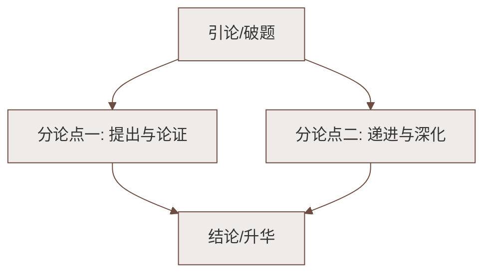

# 单元综合梳理

标签：#单元梳理 #民俗文化 #复习

## 一、单元主题概览

第一单元以**民俗**为主题，选编四篇课文：小说《社戏》、诗歌《回延安》、散文《安塞腰鼓》《灯笼》。民俗是民间流行的习俗、风尚，是人类文化的重要组成部分。单元学习重点：体会作者如何根据表达需要综合运用多种表达方式，感受多样的民俗文化。

## 二、文体与写法梳理

| 课文 | 文体 | 线索 | 主要写法 |
|---|---|---|---|
| 社戏 | 小说 | 看社戏 | 景物描写、人物刻画、详略得当 |
| 回延安 | 新诗（信天游） | 情感变化 | 比兴、夸张、拟人 |
| 安塞腰鼓 | 散文 | "好一个安塞腰鼓" | 排比、反复、短句 |
| 灯笼 | 散文 | 灯笼 | 以小见大、卒章显志 |

## 三、字词总汇

### 易读错

钳（qián）、撮（cuō）、偏僻（pì）、糜子（méi）、油馍（mó）、脑畔（pàn）、晦暗（huì）、束缚（fù）、闭塞（sè）、蓦然（mò）、恬静（tián）、幽悄（qiǎo）

### 易写错

- "撺掇"不写作"窜缀"；
- "戛然而止"的"戛"不写作"嘎"；
- "人情世故"不写作"人情事故"。

### 重点成语

叹为观止（赞美看到的事物好到极点）、戛然而止、大彻大悟、人情世故

## 四、表达方式综合运用

1. **记叙**为主干：《社戏》完整叙述看戏经过；
2. **描写**添色彩：月夜行船的景物描写、腰鼓表演的场面描写；
3. **抒情**显真情：《回延安》直接抒情，《灯笼》借物抒情；
4. **议论**点主旨：《灯笼》结尾议论升华家国情怀。

## 五、中考链接

本单元民俗题材常考题型：

1. 线索作用题：分析"灯笼""社戏"作为线索的作用；
2. 修辞赏析题：排比、反复、比兴的表达效果；
3. 情感理解题：结尾句的深层含义；
4. 民俗文化拓展题：结合本地民俗谈认识。

## 六、检测练习

1. 默写《回延安》中运用比兴手法的诗句两句。
2. "多水的江南是易碎的玻璃，在那里打不得这样的腰鼓"运用了什么写法？有何作用？
3. 结合四篇课文，说说民俗描写对表现主题的意义。

## 七、知识联系

- 课文详细笔记见[[社戏、回延安、安塞腰鼓、灯笼]]；
- 句式与结构模仿训练见[[写作：学习仿写]]；
- 交际能力训练见[[口语交际：应对]]。

### 语文阅读与写作结构

