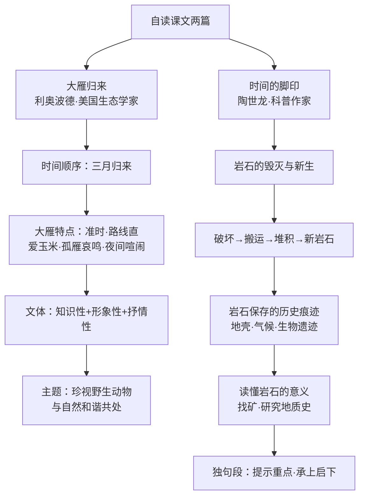

# 自读课文：大雁归来与时间的脚印

标签：#说明文 #自读课文 #科学观察

## 一、文学常识

- **利奥波德**（1887—1948），美国生态学家、"近代环保之父"，《大雁归来》选自《沙乡年鉴》，这是一部自然随笔和哲学论文集，倡导**土地伦理**观念。
- **陶世龙**（1929— ），科普作家，《时间的脚印》是一篇事理说明文，介绍岩石记录时间的奇异功能。

## 二、课文要点

### 1. 大雁归来（利奥波德）

- 内容：按时间顺序记录大雁三月归来、觅食、集会、鸣叫等活动；
- 大雁的特点：来的季节准（三月）、飞行路线直、爱寻食玉米粒、孤雁哀鸣、四月夜间群体喧闹；
- "一只燕子的来临说明不了春天，但当一群大雁冲破了三月暖流的雾霭时，春天就来到了"——大雁是春天真正的使者；
- 文体特点：兼有**知识性、形象性、抒情性**，字里行间充满对大雁的喜爱（"我们的大雁""邀请函"等拟人化称呼）。

### 2. 时间的脚印（陶世龙）

- 说明对象：岩石是记录时间的"石头书"；
- 思路：岩石毁灭与新生的过程（破坏→搬运→堆积→新岩石生成）→岩石保存的历史痕迹（地壳活动、气候变化、生物遗迹）→读懂岩石记录的意义（找矿、研究地质史）；
- 独句段的作用：提示重点、承上启下，如"岩石是怎样记下时间的呢"引出下文。

## 三、重点字词

| 字词 | 读音 | 释义 |
|---|---|---|
| 雾霭 | wù ǎi | 雾气 |
| 缄默 | jiān mò | 闭口不说话 |
| 迁徙 | qiān xǐ | 迁移 |
| 赌注 | dǔ zhù | 赌博时押上的钱物 |
| 沼泽 | zhǎo zé | 水草茂密的泥泞地带 |
| 瞄准 | miáo zhǔn | 对准目标 |
| 狩猎 | shòu liè | 打猎 |
| 腐蚀 | fǔ shí | 通过化学作用逐渐消损破坏 |
| 山麓 | shān lù | 山脚 |
| 沟壑 | gōu hè | 山沟 |
| 龟裂 | jūn liè | 裂开缝隙 |
| 海枯石烂 | hǎi kū shí làn | 形容经历极长的时间 |

## 四、段落赏析

1. 《大雁归来》"它们顺着弯曲的河流拐来拐去，穿过现在已经没有猎枪的狩猎点和小洲，向每个沙滩低语着，如同向久别的朋友低语一样"——拟人手法写出大雁归来的欢快，饱含作者的深情。
2. 《时间的脚印》"狂风吹来了，洪水冲来了，冰河爬来了"——排比、拟人，生动写出岩石被破坏的多种自然力量。

## 五、主题思想

- 《大雁归来》：呼吁人类珍视野生动物，与自然和谐共处，体现平等尊重生命的生态伦理观；
- 《时间的脚印》：引导我们认识自然记录时间的方式，激发探索自然奥秘的兴趣。

## 六、练习题

1. 《大雁归来》中作者对大雁使用了哪些拟人化的称呼？表达了怎样的感情？
2. 《时间的脚印》按什么顺序说明？找出文中起承上启下作用的独句段。
3. 结合《大雁归来》，谈谈你对"土地伦理"的理解。

## 结构图解

## 七、知识联系

- 物候与候鸟迁徙的科学原理见[[说明文阅读：大自然的语言]]；
- 岩层与地质推理的关联阅读见[[科学小品文阅读：阿西莫夫短文两篇]]；
- 环保主题的活动设计见[[写作与综合性学习：说明的顺序／倡导低碳生活]]。
