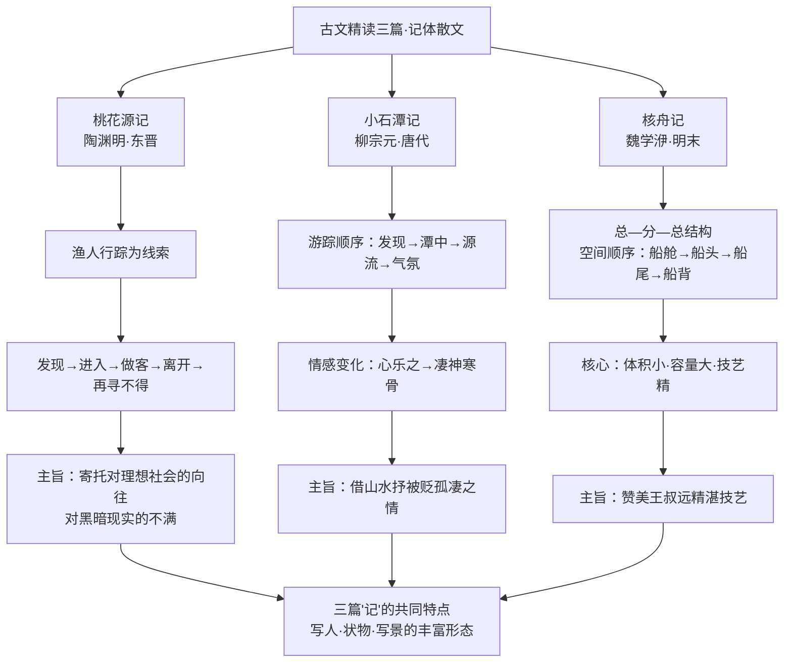

# 古文精读：桃花源记、小石潭记、核舟记

标签：#文言文 #古文精读 #中考必考

## 一、文学常识

- **陶渊明**（约 365—427），名潜，字元亮，东晋诗人，"田园诗派"开创者，《桃花源记》原是《桃花源诗》的序。
- **柳宗元**（773—819），字子厚，唐代文学家，"唐宋八大家"之一，《小石潭记》选自"永州八记"。
- **魏学洢**（约 1596—约 1625），字子敬，明末散文家，《核舟记》选自清代张潮编的《虞初新志》。

## 二、课文要点

### 1. 桃花源记

- 线索：渔人行踪（发现桃源→进入桃源→做客桃源→离开桃源→再寻桃源不得）；
- 桃源特点：环境优美（"芳草鲜美，落英缤纷"）、生活安宁（"黄发垂髫，并怡然自乐"）、民风淳朴（"设酒杀鸡作食"）；
- 主旨：虚构没有剥削压迫、和平安乐的理想社会，寄托对黑暗现实的不满与对美好生活的向往。

### 2. 小石潭记

- 游踪顺序：发现小潭→潭中景物→小潭源流→潭中气氛→同游者；
- 写景妙笔："潭中鱼可百许头，皆若空游无所依"——以鱼衬水清（侧面描写）；"斗折蛇行，明灭可见"——比喻溪流曲折；
- 情感变化："心乐之"（乐）→"凄神寒骨，悄怆幽邃"（忧），乐是忧的另一种表现形式，含被贬的孤凄悲凉。

### 3. 核舟记

- 结构：总（奇巧）—分（船舱→船头→船尾→船背）—总（通计一舟，赞"技亦灵怪矣哉"）；
- 空间顺序说明，突出核舟"体积小、容量大、技艺精"；
- 主题：赞美雕刻者王叔远的精湛技艺，反映我国古代工艺美术的卓越成就。

## 三、重点文言词语

| 词语 | 例句 | 释义 |
|---|---|---|
| 缘 | 缘溪行 | 沿着 |
| 鲜美 | 芳草鲜美 | 新鲜美好（古今异义） |
| 交通 | 阡陌交通 | 交错相通（古今异义） |
| 妻子 | 率妻子邑人 | 妻子儿女（古今异义） |
| 绝境 | 来此绝境 | 与人世隔绝的地方（古今异义） |
| 无论 | 无论魏晋 | 不要说，更不必说（古今异义） |
| 可 | 潭中鱼可百许头 | 大约 |
| 清冽 | 水尤清冽 | 清凉 |
| 佁然 | 佁然不动 | 静止不动的样子 |
| 翕忽 | 往来翕忽 | 轻快敏捷的样子 |
| 奇 | 舟首尾长约八分有奇 | 零数、余数 |
| 比 | 其两膝相比者 | 靠近 |

## 四、重点句翻译

1. 问今是何世，乃不知有汉，无论魏晋。——问现在是什么朝代，竟然不知道有过汉朝，更不必说魏、晋了。
2. 潭西南而望，斗折蛇行，明灭可见。——向小潭的西南方望去，溪水像北斗星那样曲折，像蛇那样蜿蜒前行，时隐时现。
3. 嘻，技亦灵怪矣哉！——嘻，技艺也真神奇啊！

## 五、主题思想

三篇"记"各有侧重：《桃花源记》记虚构之境寄理想，《小石潭记》记山水之景抒忧思，《核舟记》记工艺之物赞技艺，共同展示了"记"这一文体写人、状物、写景的丰富形态。

## 六、练习题

1. 归纳《桃花源记》中的三个成语并解释（世外桃源、豁然开朗、无人问津）。
2. 《小石潭记》如何做到"不着一字，尽得风流"地写水清？
3. 《核舟记》按什么顺序介绍核舟？为什么先写船舱？

## 结构图解

## 七、知识联系

- 同单元诗歌鉴赏见[[《诗经》二首：关雎、蒹葭]]；
- 读后感写作可选本课素材，方法见[[写作与综合性学习：学写读后感／古诗苑漫步]]；
- 文言积累拓展见[[名著导读与课外古诗词诵读]]。
