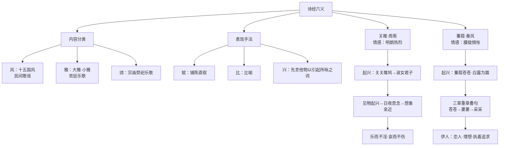

# 《诗经》二首：关雎、蒹葭

标签：#诗经 #古诗词 #中考必背

## 一、文学常识

《诗经》是我国**最早的诗歌总集**，收录西周初年至春秋中叶的诗歌 **305 篇**，先秦时称"诗"或"诗三百"，汉代尊为儒家经典。

- **内容**分为：风（十五国风，民间歌谣）、雅（大雅、小雅，宫廷乐歌）、颂（宗庙祭祀乐歌）；
- **手法**分为：赋（铺陈直叙）、比（比喻）、兴（先言他物以引起所咏之词）；
- 合称"诗经六义"。《关雎》为《周南》首篇，《蒹葭》选自《秦风》。

## 二、课文要点

### 1. 关雎

- 内容："君子"对"淑女"的爱慕与追求：见物起兴（雎鸠和鸣）→日夜思念（"寤寐求之""辗转反侧"）→想象亲近（"琴瑟友之""钟鼓乐之"）；
- 情感特点：热烈而克制，"乐而不淫，哀而不伤"（孔子评）；
- 手法：起兴（"关关雎鸠，在河之洲"引出淑女君子）、重章叠句、双声叠韵（"窈窕""参差""辗转"）。

### 2. 蒹葭

- 内容：主人公在深秋清晨溯流而上、逆流而下追寻"伊人"，可望而不可即；
- 结构：三章重章叠句，只更换个别字词（苍苍→萋萋→采采；为霜→未晞→未已），层层递进，写出时间推移与追寻不止；
- 意境：蒹葭、白露、秋水营造朦胧凄清的氛围，"伊人"意象含蓄多义——可指恋人，也可喻理想、贤才等一切执着追求而难以企及的目标。

### 3. 两诗比较

| 项目 | 关雎 | 蒹葭 |
|---|---|---|
| 情感基调 | 明朗热烈 | 朦胧惆怅 |
| 结局指向 | 想象结合的欢乐 | 追寻不得的怅惘 |
| 主要手法 | 起兴、重章叠句 | 起兴、重章叠句、意境烘托 |

## 三、重点字词

| 字词 | 读音 | 释义 |
|---|---|---|
| 雎鸠 | jū jiū | 一种水鸟 |
| 窈窕 | yǎo tiǎo | 文静美好的样子 |
| 好逑 | hǎo qiú | 好的配偶 |
| 寤寐 | wù mèi | 醒和睡，指日日夜夜 |
| 芼 | mào | 挑选 |
| 蒹葭 | jiān jiā | 芦苇 |
| 溯洄 | sù huí | 逆流而上 |
| 晞 | xī | 干 |
| 湄 | méi | 岸边，水与草相接处 |
| 跻 | jī | （路）高而陡 |
| 坻 | chí | 水中的高地 |
| 沚 | zhǐ | 水中的小块陆地 |

## 四、名句赏析

1. "关关雎鸠，在河之洲。窈窕淑女，君子好逑。"——以雎鸠和鸣起兴，引出对美好爱情的向往，奠定全诗基调。
2. "蒹葭苍苍，白露为霜。所谓伊人，在水一方。"——景物起兴，苍茫秋景与怅惘心境交融，成为千古传诵的朦胧之美。

## 五、主题思想

两首诗都是爱情诗的典范：《关雎》表现对美好爱情的坦诚向往与礼制约束下的克制；《蒹葭》抒发对"伊人"执着追寻而不得的惆怅，展示了先民真挚健康的情感世界。

## 六、练习题

1. 解释"兴"的含义，并分别指出两首诗的起兴句。
2. 《蒹葭》三章内容大体相同，这样写是否重复？说明理由。
3. 背诵默写：写出《关雎》中表现男子思念之苦的句子。

## 结构图解

## 七、知识联系

- 同单元文言散文见[[古文精读：桃花源记、小石潭记、核舟记]]；
- 古诗分类整理活动见[[写作与综合性学习：学写读后感／古诗苑漫步]]；
- 更多课外古诗积累见[[名著导读与课外古诗词诵读]]。
