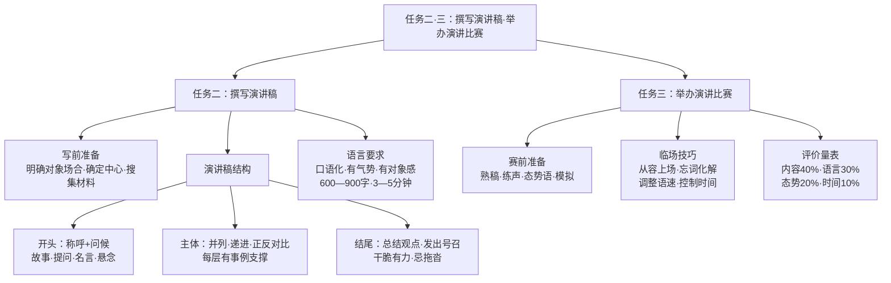

# 任务二、任务三：撰写演讲稿／举办演讲比赛

标签：#演讲 #写作实践 #活动探究

## 一、任务二：撰写演讲稿

### 1. 写作前的准备

1. **明确对象与场合**：听众是谁？年龄、身份、关注点如何？在什么场合讲？
2. **确定中心**：观点要集中、鲜明，一次演讲只讲透一个中心；
3. **搜集材料**：事例要典型新鲜，数据要准确可靠，名言要贴切。

### 2. 演讲稿的结构

| 部分 | 写法要点 |
|---|---|
| 开头 | 称呼＋问候；用故事、提问、名言或悬念抓住听众 |
| 主体 | 层层展开：并列式、递进式或正反对比式；每层有事例支撑 |
| 结尾 | 总结观点，发出号召；干脆有力，忌拖沓 |

### 3. 语言要求

1. 口语化：多用短句，少用长句和书面语堆砌；
2. 有气势：善用排比、反复、设问、反问；
3. 有对象感：适时使用"同学们""朋友们"等呼语；
4. 控制篇幅：一般 3—5 分钟，约 600—900 字。

## 二、任务三：举办演讲比赛

### 1. 赛前准备

- 熟稿：在理解基础上背诵，标出重音、停顿；
- 练声：调整语速（一般每分钟 200 字左右）、音量、语调的抑扬顿挫；
- 态势语：目光环视听众，手势自然大方，站姿挺拔；
- 模拟：对镜练习或请同学试听，反复打磨。

### 2. 临场技巧

1. 上下场从容，先站定再开口；
2. 忘词时可用重复上句、即兴过渡等方式化解，切忌慌乱；
3. 根据现场反应适当调整语速与音量；
4. 严格控制时间。

### 3. 评价量表（示例）

| 评价项 | 权重 |
|---|---|
| 内容（观点、材料） | 40% |
| 语言表达（流畅、感染力） | 30% |
| 态势神情（仪态、手势、目光） | 20% |
| 时间把控 | 10% |

## 三、练习题

1. 以"读书的力量"为题写一篇 600 字演讲稿。
2. 为你的演讲稿设计开头的三种不同方案（故事式、提问式、名言式）。
3. 小组内举行模拟演讲赛，依据评价量表互评并提出修改建议。

## 结构图解

## 四、知识联系

- 演讲词的特点见[[任务一：学习演讲词]]；
- 范文借鉴见[[课文研读：最后一次讲演、应有格物致知精神]]与[[课文研读：我一生中的重要抉择、庆祝奥林匹克运动复兴25周年]]；
- 临场应变能力训练见[[口语交际：即席讲话]]。
