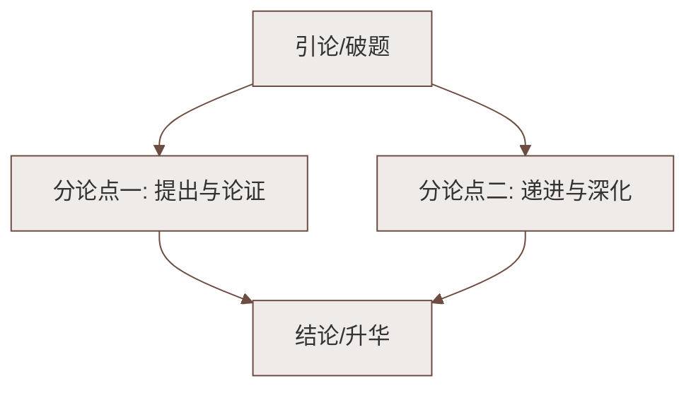

# 口语交际：即席讲话

标签：#口语交际 #即席讲话 #能力训练

## 一、知识概述

**即席讲话**指在事先没有充分准备的情况下，根据现场情境临时发表的讲话。如课堂被点名发言、聚会上被邀致辞、活动中被请谈感想等。它最能考验一个人的**思维敏捷度与语言组织能力**。

## 二、即席讲话的特点

1. **临场性**：没有成稿，须现场快速构思；
2. **针对性**：紧扣当下场合、话题和听众；
3. **简短性**：篇幅短小，一般一至三分钟，讲清一两个意思即可；
4. **灵活性**：可根据现场反应随时调整内容和语气。

## 三、基本方法

### 1. 快速构思三步法

1. **定中心**：迅速确定一个明确的中心话题，宁小勿大；
2. **搭框架**：套用简单结构——"开头（问候引入）→主体（一两层意思＋一个事例）→结尾（总结祝愿）"；
3. **抓由头**：善用现场的人、事、物、景作为话头，自然切入。

### 2. 表达技巧

- 语速稍缓，给自己留出思考时间；
- 多用短句，避免长句卡壳；
- 借助"首先……其次……最后……"等标志语理清条理；
- 讲错了不慌张，自然更正或顺势自嘲；
- 控制时间，见好就收。

### 3. 平时积累

1. 多读多背名言警句、经典事例，储备"活水"；
2. 关注时事热点与身边生活，随时可取材；
3. 抓住一切机会练习：课堂发言、班会主持、家庭聚会致辞。

## 四、常见情境应对

| 情境 | 讲话要点 |
|---|---|
| 联欢会即兴致辞 | 感谢＋称赞气氛＋美好祝愿 |
| 获奖感言 | 感谢＋归功他人＋表决心 |
| 欢迎新同学 | 欢迎＋介绍集体＋表达期待 |
| 课堂即兴发言 | 亮观点＋一个理由或例子＋小结 |

## 五、练习题

1. 情境模拟：班级读书会上，老师临时请你谈谈最近读的一本书，请作一分钟即席讲话。
2. 运动会上你班获得团体第一，作为班长请即席发表 30 秒获奖感言。
3. 抽签练习：每人抽取一个话题（如"我的座右铭""难忘的一节课"），准备一分钟后作两分钟讲话，同学互评。

## 六、知识联系

- 机智应答的基础训练见[[口语交际：应对]]；
- 有准备的演讲与即席讲话的比较见[[任务一：学习演讲词]]；
- 演讲比赛的临场技巧见[[任务二、任务三：撰写演讲稿／举办演讲比赛]]。

### 语文阅读与写作结构

